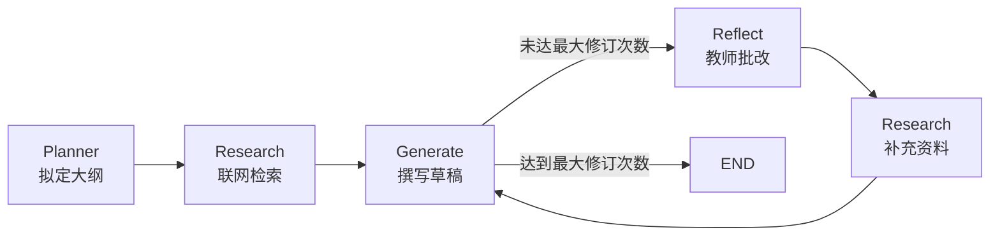

# ✍️ Essay Writer · 基于 DeepSeek 的多 Agent 写作 Web 应用

> 使用 React + FastAPI + LangGraph + DeepSeek 构建的「多 Agent 作文写作」系统，支持**大纲规划 → 资料检索 → 草稿撰写 → 教师批改 → 修订迭代**完整流程。

程序运行演示

[【无声演示】文章写作助手](https://www.bilibili.com/video/BV1GQaW6BEYW/)


---


## 🌟 功能特性

- 🧠 **多 Agent 协作**：规划师 / 研究员 / 撰稿人 / 教师四个 Agent 通过 LangGraph 串联，自动迭代修订
- ⚡ **DeepSeek 大模型**：通过 OpenAI 兼容接口调用 `deepseek-chat`，国内可直接使用
- 🎨 **现代化 React 前端**：暗色玻璃拟态风格，实时流式（SSE）展示每一步产物
- 🔧 **可配置**：所有密钥、模型、端口集中在 `config.env`
- 🔌 **可选联网检索**：填入 `TAVILY_API_KEY` 自动启用；未配置则跳过检索环节

---

## 📁 项目结构

```
EssayWriter/
├── config.env                  # 配置文件（DEEPSEEK_API_KEY 等）
├── README.md                   # 本文档
├── backend/                    # Python 后端
│   ├── main.py                 # FastAPI 入口（SSE 流式接口）
│   ├── essay_graph.py          # LangGraph 多 Agent 图（调用 DeepSeek）
│   ├── prompts.py              # Agent 提示词
│   ├── models.py               # 状态类型定义
│   └── requirements.txt        # Python 依赖
└── frontend/                   # React 前端
    ├── package.json
    ├── public/index.html
    └── src/
        ├── index.js
        ├── index.css
        ├── App.js
        ├── App.css
        └── components/
            ├── EssayForm.js
            ├── StatusBar.js
            ├── PlanDisplay.js
            ├── CritiqueDisplay.js
            └── EssayDisplay.js
```

---

## 🚀 快速开始

### 0. 前置准备

- **Python** ≥ 3.9
- **Node.js** ≥ 16
- 一个 **DeepSeek API Key**（[点此申请](https://platform.deepseek.com/)）
- （可选）一个 **Tavily API Key**（[点此申请](https://tavily.com/)，用于联网检索）

### 1. 配置 `config.env`

编辑项目根目录下的 `config.env`：

```env
# 必填：DeepSeek API Key
DEEPSEEK_API_KEY=sk-xxxxxxxxxxxxxxxxxxxxxxxx

# 可选：模型与端点（默认即可）
DEEPSEEK_MODEL=deepseek-chat
DEEPSEEK_BASE_URL=https://api.deepseek.com/v1

# 可选：Tavily 联网检索 Key（留空则跳过检索）
TAVILY_API_KEY=

# 可选：服务端口
BACKEND_PORT=8000
FRONTEND_PORT=3000
```

### 2. 启动后端（FastAPI）

```bash
cd backend
python -m venv .venv
source .venv/bin/activate          # Windows: .venv\Scripts\activate
pip install -r requirements.txt

# 启动服务（默认 0.0.0.0:8000）
python main.py
# 或：uvicorn main:app --host 0.0.0.0 --port 8000 --reload
```

后端启动后访问 [http://localhost:8000/api/health](http://localhost:8000/api/health)，看到 `"status": "ok"` 即表示就绪。

### 3. 启动前端（React）

新开一个终端：

```bash
cd frontend
npm install
npm start
```

浏览器自动打开 [http://localhost:3000](http://localhost:3000)。

> 💡 前端通过 `proxy` 自动转发 `/api/*` 到 `http://localhost:8000`，无需额外配置 CORS。
> 如需自定义后端地址，可在 `frontend/.env` 中设置 `REACT_APP_API_BASE`。

---

## 🧩 工作流




| 节点                | 角色       | 输入               | 输出                |
| ------------------- | ---------- | ------------------ | ------------------- |
| `planner`           | 写作规划师 | 题目               | `plan` 大纲         |
| `research_plan`     | 资料研究员 | 题目 + 大纲        | `content` 检索素材  |
| `generate`          | 撰稿人     | 题目 + 大纲 + 素材 | `draft` 草稿        |
| `reflect`           | 教师       | 草稿               | `critique` 批改建议 |
| `research_critique` | 资料研究员 | 批改意见           | 增量补充`content`   |
| `should_continue`   | 控制器     | 当前轮次           | `END` 或 `reflect`  |

---

## 🔌 API 文档

### `GET /api/health`

健康检查，返回 DeepSeek 是否已配置。

```json
{
  "status": "ok",
  "deepseek_configured": "yes",
  "model": "deepseek-chat"
}
```

### `POST /api/essay/generate`

流式（SSE）生成作文。

**请求体**：

```json
{
  "task": "人工智能对现代教育的影响",
  "max_revisions": 2
}
```

**响应**（`text/event-stream`）：每条 `data:` 行均为一段 JSON：

```json
{ "type": "node", "node": "planner", "data": { "plan": "..." } }
{ "type": "node", "node": "research_plan", "data": { "content_count": 6 } }
{ "type": "node", "node": "generate", "data": { "draft": "...", "revision_number": 2 } }
...
{ "type": "done", "node": "final", "data": { "draft": "...", "plan": "...", "critique": "..." } }
```

错误示例：

```json
{ "type": "error", "message": "DEEPSEEK_API_KEY 未配置" }
```

---

## ⚙️ 常见问题

<details>
<summary><b>Q: 没有 DEEPSEEK_API_KEY 可以跑吗？</b></summary>

A: 启动后端时会通过 `/api/health` 检测，未配置 Key 时接口会返回 `500`。请前往 [platform.deepseek.com](https://platform.deepseek.com/) 注册并充值后获取。

</details>

<details>
<summary><b>Q: Tavily 检索是必须的吗？</b></summary>

A: 不是。`config.env` 中 `TAVILY_API_KEY` 留空即可跳过联网检索，多 Agent 流程会自动降级（仅依赖 DeepSeek 的内在知识）。

</details>

<details>
<summary><b>Q: 可以切换到 OpenAI / 其它兼容模型吗？</b></summary>

A: 可以。修改 `config.env` 中的 `DEEPSEEK_BASE_URL` 与 `DEEPSEEK_MODEL` 即可。例如切换到 OpenAI 官方：

```env
DEEPSEEK_API_KEY=sk-xxxxxxxx
DEEPSEEK_BASE_URL=https://api.openai.com/v1
DEEPSEEK_MODEL=gpt-4o-mini
```

由于代码使用 `langchain_openai.ChatOpenAI`，所有 OpenAI 兼容端点（OpenRouter、火山引擎方舟、硅基流动等）都适用。

</details>

<details>
<summary><b>Q: 前端端口被占用怎么办？</b></summary>

A: 设置 `PORT=3001 npm start`；同时在前端项目根目录新建 `.env`：

```env
PORT=3001
REACT_APP_API_BASE=http://localhost:8000
```

</details>

---

## 📜 License

MIT License · 仅供学习交流使用，请遵守 DeepSeek / Tavily 的服务条款。

---

## 🙏 致谢

- 原始 LangGraph 教学案例：[DeepLearning.AI / AI Agents in LangGraph](https://www.deeplearning.ai/short-courses/ai-agents-in-langgraph/)
- [DeepSeek](https://platform.deepseek.com/) 提供 OpenAI 兼容的大模型推理服务
- [LangGraph](https://langchain-ai.github.io/langgraph/) / [FastAPI](https://fastapi.tiangolo.com/) / [React](https://react.dev/)
