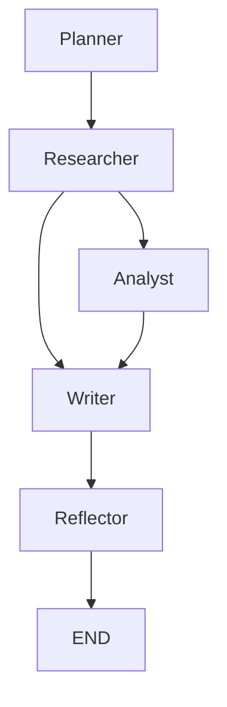

# Manus+ Super Agent (React + FastAPI + DeepSeek)

多智能体编排演示系统：

- 意图检测 (Intent Detection)
- 编排 DAG（planner → researcher → writer → reflector，LangGraph 实现）
- 轻量内存 RAG（可索引文本）
- 安全策略检查
- 简单反思 (Reflection)
- FastAPI 后端 + **React 前端 Web 应用**
- 执行轨迹日志（`runs/trace_*.json`）与可视化

## 参考代码

https://github.com/yh-yao/super_agent_book/tree/main/%E8%B6%85%E7%BA%A7%E6%99%BA%E8%83%BD%E4%BD%93%E5%AE%9E%E6%88%98


## 架构

```
React 前端 (web/, Vite + React 18)
        │  HTTP /api/*（开发态由 Vite 代理到 8000）
        ▼
FastAPI 后端 (app/main.py)
        │  LangGraph 编排
        ▼
DeepSeek 模型 (DEEPSEEK_API_KEY, deepseek-chat / deepseek-reasoner)
```

## 配置：config.env

所有模型配置集中放在根目录 `config.env`（已在 `app/settings.py` 中自动加载）：

```env
DEEPSEEK_API_KEY=sk-your-deepseek-api-key
DEEPSEEK_BASE_URL=https://api.deepseek.com
DEEPSEEK_MODEL=deepseek-chat
DEEPSEEK_MODEL_REASONER=deepseek-reasoner
```

> 请将 `sk-your-deepseek-api-key` 替换为你的真实 DeepSeek API Key。
> Key 也可通过环境变量 `DEEPSEEK_API_KEY` 覆盖。

## Quickstart

### 1. 后端

```bash
# python -m venv .venv && source .venv/bin/activate
pip install -r requirements.txt

# 编辑 config.env，填入你的 DEEPSEEK_API_KEY
uvicorn app.main:app --reload
# API 文档: http://127.0.0.1:8000/docs
```

### 2. React 前端

```bash
cd web
npm install
npm run dev
# 打开 http://127.0.0.1:5173
```

前端页面包含三个模块：

- **对话**：调用 `/chat`，走完整多智能体流水线，展示回复与 RAG 引用来源
- **知识库**：调用 `/ingest/text`，将文本写入向量库供检索引用
- **工具**：调用 `/tool/exec`，安全数学表达式求值

### 3. 生产构建

```bash
cd web && npm run build   # 产物在 web/dist，可由任意静态服务器托管
```

## Demo call

POST `/chat` with JSON:
```json
{
  "user": {"user_id":"u1","name":"You","safety_tier":"normal"},
  "message": "请介绍一下这个超级智能体的能力，并给出实现建议"
}
```

## Extended Endpoints

- `POST /ingest/text` — 索引一段文本到 RAG  
  form fields: `text`, `source`

- `POST /ingest/image` — 上传图片（演示版 OCR，占位作索引）

- `POST /ingest/audio` — 上传音频（演示版 ASR，占位作索引）

- `POST /analyze/csv` — 上传 CSV 返回基础统计，并把摘要写入向量库

- `POST /tool/exec` — 安全数学表达式求值（仅允许 `math.*` 与常见运算），示例：
  ```bash
  curl -X POST -F 'expr=sin(pi/2)+sqrt(9)' http://127.0.0.1:8000/tool/exec
  ```

## DeepSeek 模型说明

- 使用 `DEEPSEEK_API_KEY` 调用 DeepSeek（OpenAI 兼容协议，`base_url=https://api.deepseek.com`）
- 默认模型 `deepseek-chat`；如需深度推理可在 `config.env` 中将 `DEEPSEEK_MODEL` 设为 `deepseek-reasoner`
- 模型路由配置见 `configs/models.yaml`，实际客户端实现见 `models/llm_clients.py`

## Orchestrator DAG (LangGraph)

下面是多智能体编排的有向图：



## Execution Trace Logging

每次调用 `/chat`，系统都会在 `runs/trace_*.json` 中记录轨迹，包含：
- 节点名 (planner / researcher / writer / reflect …)
- 输入消息
- 输出结果
- 命中引用 (citations)
- 安全策略 flags

示例：

```json
[
  {
    "node": "planner",
    "messages_in": [{"role":"user","content":"介绍一下超级智能体"}],
    "outcome_before": null,
    "outcome_after": null,
    "safety_flags": [],
    "citations": []
  }
]
```

## Trace Visualization

你可以使用工具 `tools/trace_viz.py` 将 JSON 轨迹转为 Markdown 表格或 Mermaid 序列图：

```bash
python tools/trace_viz.py runs/trace_20250918_203000.json --fmt md
python tools/trace_viz.py runs/trace_20250918_203000.json --fmt mermaid
```

## 项目结构

```
SuperAgent/
├── config.env            # DeepSeek API 等配置（需自行填 Key）
├── configs/models.yaml   # 模型路由配置
├── app/                  # FastAPI 应用（schemas / settings / deps）
├── agents/               # planner / researcher / writer / analyst
├── core/                 # 编排、路由、安全、反思、轨迹
├── models/               # LLM 客户端（DeepSeek）
├── rag/                  # 索引与检索
├── tools/                # 文件、安全计算等工具
└── web/                  # React 前端（Vite）
```
