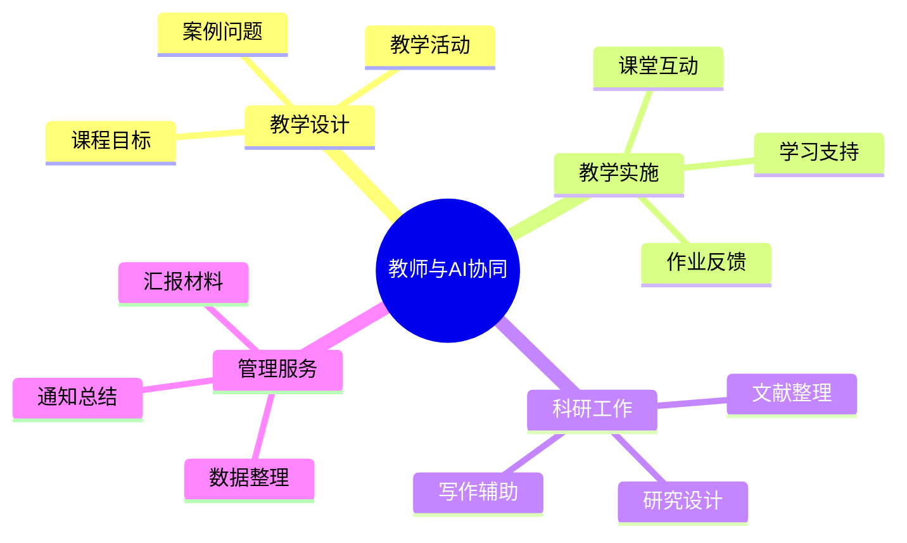

# 第一部分

## 为什么大学教师需要 AI？

0—5分钟

---

# 教师工作中的“时间黑洞”

| 工作类型 | 典型任务 | 常见问题 |
|---|---|---|
| 教学准备 | 查资料、写教案、做课件 | 重复劳动多 |
| 课堂教学 | 设计案例、问题和活动 | 难以持续创新 |
| 学生指导 | 回复问题、批改作业 | 个性化程度有限 |
| 科学研究 | 阅读文献、整理资料 | 信息过载 |
| 学术写作 | 修改表达、组织结构 | 反复打磨耗时 |
| 行政事务 | 写总结、填表、做汇报 | 格式性工作多 |

AI 最适合处理：**高频、重复、结构化、可检查的工作。**

---

# AI 在教师工作中的角色

AI 是“副驾驶”，不是“自动驾驶”。
AI 是“助手”，不能代替“教师”。

---
layout:two-cols
---

## 适合交给 AI 的任务

- 提供初稿、提纲和备选方案
- 对长文本进行摘要、分类和比较
- 将一种表达转换为另一种格式
- 设计问题、案例、练习和评价量规
- 检查语言、结构和逻辑
- 辅助生成代码、表格和分析思路

::right::

## 不应完全交给 AI 的任务

- 最终学术判断
- 关键事实和数据确认
- 学生评价的最终决定
- 涉及隐私或未公开数据的处理
- 学术伦理和研究结论判断
