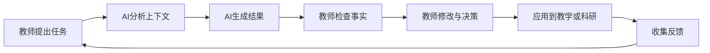

# 第二部分

## AI工具与提示词基础

5—15分钟

---

# Workbuddy 等 AI 工具可以做什么？

根据具体版本和权限，AI 助手通常可以支持：

- 对话问答与内容生成
- 文档总结、改写和比较
- 表格信息整理
- 教学材料和汇报材料生成
- 代码解释与调试
- 多轮对话和任务拆解
- 基于上传材料进行问答
- 生成图片、流程图或结构化内容


**注意：使用前应确认平台的数据处理、存储和权限政策。**


---

# 超星智慧教学平台 等 AI 工具可以做什么？

- AI教案生成
- AI课件生成
- AI出题与自动组卷
-

---

# AI 的基本工作模式




高质量应用不是“一次提问”，而是：

> **提出任务 → 获得初稿 → 追问改进 → 人工核验 → 形成成果**


---

# 高质量提示词的五个要素

一个可执行的提示词通常包括：

1. **角色**：希望 AI 扮演什么角色？
2. **任务**：具体要完成什么？
3. **背景**：面向谁、用于什么场景？
4. **要求**：格式、风格、长度、评价标准
5. **输出**：希望以表格、清单、提纲还是代码呈现


提示词公式：

**角色 + 任务 + 背景 + 约束 + 输出格式 + 评价标准**


---

# 从模糊提问到有效提示词

## 模糊提问

> 帮我设计一节课。

## 改进后的提示词

> 你是一名有经验的大学教师。请为“管理学原理”课程设计一节90分钟的课堂教学方案，主题为“决策中的认知偏差”。学生为大二本科生，已有基础管理学知识。请包含：教学目标、重点难点、课堂导入、三个互动活动、案例材料、课堂练习、形成性评价和课后作业。请用表格输出，并确保教学目标使用可观察、可测量的动词。

---

# 一个可复用的提示词模板

```text
你是一名【专业/角色】。

请帮助我完成【具体任务】。

背景信息：
- 课程/项目：
- 学习者/研究对象：
- 使用场景：
- 已有材料：

具体要求：
1. 【要求一】
2. 【要求二】
3. 【要求三】

请按照【表格/提纲/清单/代码/JSON】格式输出。
请标注不确定信息，并列出需要人工核验的内容。
```


建议将常用提示词保存为个人模板库。

