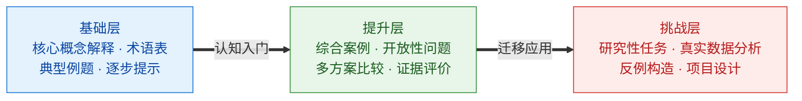
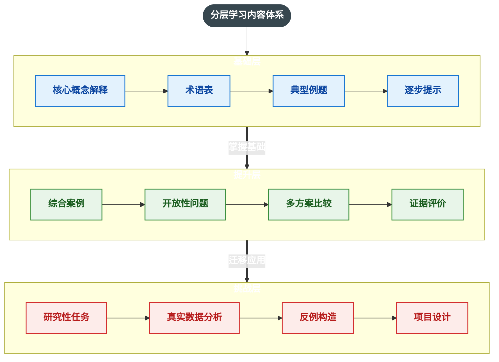

# 第三部分

## AI赋能大学教学

15—37分钟

---

# 教学环节一：课程目标与教学大纲

AI 可以辅助教师：

- 将课程简介转换为教学目标
- 检查目标与教学活动是否匹配
- 根据专业认证要求重新组织目标
- 设计知识、能力和素养目标
- 生成周次安排和课程进度表
- 发现课程内容中的重复和缺口


教师需要提供：课程定位、学生基础、学时、教学要求和评价方式。

---
layout: two-cols
---
# 教学目标设计示例


::left::

## 给 AI 的任务

```text
请根据以下课程信息，设计 4 个可测量的课程学习目标。每个目标包含：目标动词、学习内容、达成标准和评价方式。避免使用“了解”“掌握”等不可观察的动词。

数据分析是指针对研究对象获取数据，运用数学方法对数据进行整理、分析和推断，形成关于研究对象知识的素养。 数据分析源于研究随机现象，是数字化时代数学应用的一种主要方法。数据分析已经深入科学、技术、工程和现代社会生活的各个方面。 数据分析主要表现为：结合具体问题，选择合适的方法收集和整理数据，运用统计工具和其他数学工具描述和分析数据，提取信息，获得并解释结论。 通过课程的学习，学生能提升获取有价值信息并进行定量分析的意识和能力；适应数字化学习的需要，增强基于数据表达现实问题的意识，形成通过数据认识事物的思维品质；积累依托数据探索事物本质、关联和规律的活动经验。
```

::right::
## AI 输出应重点检查

- 目标是否可观察？
- 是否与课程内容对应？
- 是否超出学生实际水平？
- 是否能够被评价？
- 是否涵盖知识、能力与应用？

AI 提供候选方案，教师负责根据专业特色和学生实际进行取舍。


---
layout: two-cols
---

::left::

# 教学环节二：备课与课件生成

AI 可协助生成：

- 课程章节提纲
- 教学重点与难点
- 概念解释和类比
- 课堂导入问题
- 案例材料
- 课堂讨论题
- 课堂小测
- 课后延伸阅读

::right::

# 推荐流程

```text
课程目标
  ↓
知识结构
  ↓
教学活动
  ↓
课堂材料
  ↓
学习评价
```

---

# 课堂案例生成提示词

```text
你是一名大学案例教学设计专家。

请为“物理学与信息技术”课程设计一个课堂案例，
主题是“卫星定位系统的发展和应用”。

要求：
- 面向高职一年级；
- 案例背景不少于500字；
- 包含一个真实感强但不依赖他人隐私的情境；
- 设置3个递进式讨论问题；
- 提供教师引导思路；
- 区分事实信息、假设信息和待核验信息；
- 最后给出一个20分钟课堂活动流程。
```

提示：案例中的名称、数据和事件必须核验，不能将 AI 虚构内容直接当作事实。

---

# 课堂互动设计：从讲授到学习活动

AI 可以帮助教师把一个知识点转换为多种活动：

| 教学目标 | 可设计的活动 |
|---|---|
| 理解概念 | 概念辨析、同伴解释 |
| 应用方法 | 情境任务、案例分析 |
| 分析问题 | 小组讨论、证据比较 |
| 评价方案 | 角色扮演、辩论 |
| 创造成果 | 项目设计、作品展示 |


提示词示例：

> 请将“社会调查与数据分析”这一知识点设计为一项45分钟的小组任务，包含角色分工、任务说明、过程产出、评价标准和教师追问。


---
layout: default
---

# 分层教学与个性化学习

同一个知识点，可以让 AI 生成不同难度的材料,分层的目标是为学生提供不同的学习入口。




---
disabled: true
---



---

# AI 辅助作业设计

## 一个高质量作业应包含

- 明确的学习目标
- 真实或拟真的问题情境
- 学生需要提交的成果
- 过程性要求
- 评价标准
- 学术诚信要求
- 允许使用和禁止使用 AI 的范围

## 示例任务

> 请学生使用经济数学模型分析一个经济现象，并提交：问题定义、模型建立、参数确定、求解计算、结果检验、模型改进等。


---
theme: default
title: 经济数学模型分析 · 作业任务
info: |
  高校经济学类课程 · 作业任务卡（单页）
  2—3 人小组 ｜ 4 周 ｜ 占总评 30%
canvasWidth: 1280
aspectRatio: '16/9'
mdc: true
fonts:
  sans: PingFang SC, Hiragino Sans GB, Microsoft YaHei, Source Han Sans SC
  provider: none
---

<div class="tc">

<div class="tc-top">
  <div class="tc-top-title">经济数学模型分析 · 作业任务</div>
  <div class="tc-top-meta">2—3 人小组　｜　4 周　｜　占总评 30%</div>
</div>

<div class="tc-task">
  <span class="tc-task-label">任务</span>
  <span>选一个真实或拟真的经济现象，用经济数学模型回答它，并说清结论在什么条件下成立。</span>
</div>

<div class="tc-block">

<div class="tc-cap">建模闭环 · 六项成果缺一不可</div>


</div>

<div class="tc-block">

<div class="tc-cap">过程节点 · 不接受只交终稿，每次活动留建模日志（不少于 4 条）</div>


</div>

<div class="tc-cards">
  <div class="card">
    <div class="card-main">
      <div class="card-head">
        <span class="card-no">01</span>
        <span class="card-title">提交成果</span>
      </div>
      <p class="card-body">3000—4000 字报告，逐环节完成六项论证；另附数据文件、可运行代码，以及《AI 使用声明表》《数据真实性声明》。</p>
    </div>
    <div class="card-tag">报告 · 数据 · 代码 · 声明表</div>
  </div>

  <div class="card card-accent">
    <div class="card-main">
      <div class="card-head">
        <span class="card-no">02</span>
        <span class="card-title">评价标准</span>
      </div>
      <p class="card-body">过程性 20 ＋ 终稿 60 ＋ 答辩 20 ＝ 100 分。终稿六维权重：结果检验 25%，模型建立与参数确定各 20%，求解计算 15%，问题定义与模型改进各 10%。</p>
    </div>
    <div class="card-tag">结果检验权重最高</div>
  </div>
</div>

<div class="tc-foot">
  <span class="tc-foot-label">诚信与 AI</span>
  <span class="tc-foot-body">AI 可用于检索、解释、代码草稿与语言润色；<span class="warn">禁止代写实质内容、伪造数据、提交看不懂的代码</span>。答辩随机抽问，答不出按未达成计分。</span>
</div>

</div>

<style>
.tc {
  width: 100%;
  height: 100%;
  display: flex;
  flex-direction: column;
  gap: 12px;
  background: #ffffff;
  color: #1a2230;
  font-family: "PingFang SC", "Hiragino Sans GB", "Microsoft YaHei", "Source Han Sans SC", sans-serif;
  box-sizing: border-box;
}

.tc-top {
  flex: 0 0 56px;
  display: flex;
  align-items: center;
  justify-content: space-between;
  padding: 0 24px;
  background: #0e3f8c;
  border-radius: 6px;
}
.tc-top-title {
  font-size: 30px;
  font-weight: 700;
  color: #ffffff;
  letter-spacing: 1px;
}
.tc-top-meta {
  font-size: 16px;
  color: #c7d7ef;
}

.tc-task {
  flex: 0 0 52px;
  display: flex;
  align-items: center;
  gap: 16px;
  padding: 0 20px;
  background: #f0f5fc;
  border-left: 6px solid #1e4fa8;
  font-size: 22px;
  line-height: 1.5;
}
.tc-task-label {
  font-size: 22px;
  font-weight: 700;
  color: #0e3f8c;
}

.tc-block {
  flex: 0 0 auto;
  display: flex;
  flex-direction: column;
  gap: 4px;
}
.tc-cap {
  font-size: 16px;
  color: #8b97a8;
}

.tc-cards {
  flex: 1 1 auto;
  display: flex;
  gap: 14px;
  min-height: 0;
}
.card {
  flex: 1;
  display: flex;
  flex-direction: column;
  justify-content: space-between;
  padding: 18px 20px;
  background: #ffffff;
  border: 1px solid #d6dce5;
  border-radius: 8px;
  box-sizing: border-box;
}
.card-accent {
  background: #f7f9fc;
  border-color: #b9cde9;
}
.card-main {
  display: flex;
  flex-direction: column;
  gap: 10px;
}
.card-head {
  display: flex;
  align-items: center;
  gap: 10px;
}
.card-no {
  display: inline-flex;
  align-items: center;
  justify-content: center;
  width: 30px;
  height: 30px;
  background: #1e4fa8;
  color: #ffffff;
  font-size: 16px;
  font-weight: 700;
}
.card-title {
  font-size: 24px;
  font-weight: 700;
  color: #0e3f8c;
}
.card-body {
  margin: 0;
  font-size: 22px;
  line-height: 1.5;
  color: #1a2230;
}
.card-tag {
  align-self: flex-start;
  display: inline-flex;
  align-items: center;
  height: 30px;
  padding: 0 14px;
  background: #f0f5fc;
  border-radius: 15px;
  font-size: 16px;
  color: #1e4fa8;
}
.card-accent .card-tag {
  background: #e8eff8;
}

.tc-foot {
  flex: 0 0 72px;
  display: flex;
  align-items: center;
  gap: 18px;
  padding: 0 20px;
  background: #f0f5fc;
  border-left: 6px solid #d9534f;
}
.tc-foot-label {
  font-size: 22px;
  font-weight: 700;
  color: #0e3f8c;
}
.tc-foot-body {
  flex: 1;
  font-size: 22px;
  line-height: 1.5;
  color: #1a2230;
}
.warn {
  font-weight: 700;
  color: #d9534f;
}
</style>


---

# 评价量规（Rubric）生成提示词

```text
请为以下课程作业设计一份四级评价量规。

作业主题：分析一家企业的数字化转型案例
学习目标：
1. 能够识别数字化转型中的关键问题；
2. 能够使用相关理论进行分析；
3. 能够基于证据提出改进方案；
4. 能够规范引用资料。

请设置以下评价维度：
- 问题定义
- 理论应用
- 证据质量
- 方案可行性
- 结构与表达
- 引用规范

每个维度分别描述优秀、良好、合格和需改进四个等级。
```

---

# AI 辅助学生作业反馈

## 推荐反馈结构

1. 先指出完成得好的地方；
2. 再指出最重要的一个问题；
3. 解释问题为什么重要；
4. 给出修改方向，而不是直接替学生改完；
5. 提出一个促进反思的问题。


## 提示词示例

> 请根据以下评价量规，对学生作业提供形成性反馈。不要直接重写全文，不要替学生完成任务。请按照“优点—主要问题—修改建议—反思问题”的结构输出。对于无法确认的事实，请标注“需要核验”。


AI 反馈应作为教师判断的辅助，不能未经审阅直接决定成绩。


---

# 教学场景演示：10分钟 AI 备课工作流

## 演示任务

为“物理学与新材料”设计一节90分钟课程：

> 主题：纳米材料的特性和应用

## 演示步骤

1. 输入课程背景和学生信息；
2. 要求 AI 生成教学目标；
3. 追问并修改课堂活动；
4. 生成案例和讨论问题；
5. 生成课堂小测；
6. 生成评价量规；
7. 检查事实、理论来源和教学可行性；
8. 将结果整理成课件和教师教案。


---
layout: two-cols
---

::left::
# 教学数据与课程改进

AI 可以辅助分析：

- 学生问卷中的高频意见
- 课堂讨论记录
- 作业中常见错误
- 测验题目的难度和区分度
- 不同教学活动的反馈
- 学生对知识点的困惑

::right::
## 基本流程

```text
收集脱敏数据
  → 分类整理
  → 识别高频问题
  → 提出教学假设
  → 设计改进措施
  → 下一轮教学验证
```

不要上传包含姓名、学号、联系方式、成绩等个人身份信息的原始数据。
