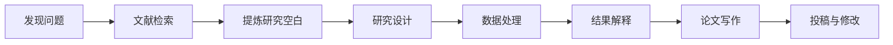

---

# 第四部分

## AI赋能科学研究

37—54分钟

---

# 科研工作流中的 AI 应用点



AI 可以在每个环节提供辅助，但不能代替：

- 研究问题的真正价值判断；
- 数据真实性判断；
- 因果关系的科学论证；
- 学术责任和署名责任。

---

# 科研环节一：文献阅读与知识整理

AI 可以帮助教师：

- 生成论文摘要的初步版本
- 提取研究问题、方法、样本和结论
- 比较多篇论文的研究设计
- 形成主题分类表
- 发现概念之间的联系
- 将专业论文转换为教学或汇报语言

## 推荐文献整理表

| 文献 | 研究问题 | 理论框架 | 方法 | 样本 | 主要结论 | 局限 |
|---|---|---|---|---|---|---|


AI 负责整理，研究者必须回到原文核对。


---

# 文献阅读提示词

```text
请根据我提供的论文内容，提取以下信息：

1. 研究问题；
2. 理论基础；
3. 核心概念及其定义；
4. 研究假设；
5. 数据来源与样本特征；
6. 研究方法；
7. 主要发现；
8. 作者承认的局限；
9. 可以进一步研究的问题。

要求：
- 只根据提供的文本回答；
- 找不到的信息标记为“原文未说明”；
- 不要补写不存在的参考文献；
- 对每项结论标注对应的章节或页码。
```

---

# 文献综述：从“罗列”到“论证”

AI 可以帮助我们识别：

- 不同研究的共同结论
- 研究结论之间的矛盾
- 理论视角的差异
- 样本和方法的差异
- 尚未解决的问题
- 可能的研究空白

## 文献综述的基本逻辑

```text
已有研究发现了什么？
        ↓
不同研究之间有什么差异？
        ↓
为什么会产生这些差异？
        ↓
现有研究还缺少什么？
        ↓
我的研究如何回应这一缺口？
```


真正的文献综述不是“文献摘要的堆积”，而是围绕研究问题建立论证。


---

# 科研环节二：研究问题与研究设计

AI 可以作为“研究设计讨论伙伴”，帮助提出：

- 研究问题的不同表述
- 变量和概念的可能关系
- 可比较的理论解释
- 研究对象和样本方案
- 访谈提纲或问卷初稿
- 实验条件和控制变量
- 可能的替代解释

## 示例提示词

> 请以研究方法教师的身份，帮助我审查以下研究问题。请从研究价值、可操作性、变量清晰度、数据可得性和伦理风险五个方面提出意见，并给出三个改写版本。不要直接声称该问题具有创新性。

---

# 研究设计中的“反向质询”

可以要求 AI 扮演审稿人：

```text
请扮演一名严格但建设性的匿名审稿人，
审查以下研究设计。

请重点检查：
- 研究问题是否清晰；
- 理论与假设是否匹配；
- 样本是否足以支持结论；
- 是否存在混淆变量；
- 测量工具是否合理；
- 是否存在选择偏差；
- 结论是否可能超出数据支持范围；
- 伦理和隐私风险。

请将意见分为：
“必须修改”“建议修改”“可以进一步讨论”。
```


AI 的价值之一：帮助研究者提前发现“自己没有想到的问题”。


---

# 科研环节三：数据分析与代码辅助

AI 可辅助：

- 解释统计方法的适用条件
- 生成数据处理代码初稿
- 解释报错信息
- 设计数据清洗步骤
- 辅助生成可视化代码
- 检查分析流程是否完整
- 将分析结果转换为易懂的文字

## 但必须注意

- 不向公共平台上传敏感原始数据；
- 不把 AI 生成的代码直接用于正式分析；
- 检查变量名称、缺失值和样本量；
- 运行代码并保存版本；
- 保留人工决策和修改记录；
- 不让 AI 虚构统计结果。

---

# 数据分析代码提示词

```text
你是一名熟悉 Python 和 pandas 的数据分析助手。

我有一个匿名化的问卷数据表，变量包括：
- gender：性别
- age：年龄
- engagement：学习投入
- achievement：学习成绩

请完成以下任务：
1. 检查变量类型和缺失值；
2. 计算各变量的描述性统计；
3. 绘制 engagement 与 achievement 的散点图；
4. 计算相关系数；
5. 给出可运行的 Python 代码；
6. 解释每一步的目的；
7. 列出使用该分析方法的前提条件。

不要虚构任何分析结果。
```

---

# 科研环节四：论文写作与语言润色

AI 可以辅助：

- 生成论文结构提纲
- 检查段落逻辑
- 优化学术表达
- 压缩重复内容
- 统一术语和语体
- 生成审稿意见回复框架
- 将中文初稿转换为英文表达建议

## 推荐使用方式

```text
研究者先完成核心论点
        ↓
AI帮助整理结构
        ↓
AI提供语言修改建议
        ↓
研究者核对含义和证据
        ↓
研究者确认最终版本
```


AI 可以润色表达，但不能替研究者创造数据、结论、引用和创新贡献。


---

# 学术写作润色提示词

```text
请对以下论文段落进行学术语言润色。

要求：
- 保留原有观点和证据；
- 不新增未经提供的事实；
- 不改变因果关系；
- 减少口语化表达；
- 优化句子之间的逻辑衔接；
- 保持术语前后一致；
- 输出“修改后版本”和“主要修改说明”；
- 对可能存在逻辑跳跃的地方单独标注。

原文：
【粘贴经过脱敏的文本】
```

---

# 科研环节五：基金申请与项目汇报

AI 可辅助生成和检查：

- 项目摘要初稿
- 研究背景的逻辑结构
- 研究目标与研究内容
- 技术路线文字说明
- 研究进度安排
- 可能的创新点表述
- 风险分析和备选方案
- 答辩汇报提纲

## 评审视角提示词

> 请以项目评审专家的身份，分别从科学问题、研究基础、技术路线、创新性、可行性和预期成果六个方面评价以下项目摘要。请避免泛泛表扬，指出最可能导致评审人产生疑问的三处内容，并给出修改建议。

---

# 科研场景演示：从文献到研究方案

## 15分钟工作流

1. 将已核验的文献摘要整理为表格；
2. 要求 AI 按主题归类；
3. 找出不同研究之间的差异；
4. 让 AI 以审稿人身份提出质疑；
5. 进一步明确研究问题；
6. 生成变量关系或研究框架；
7. 形成研究设计初稿；
8. 人工检查理论、方法、数据和伦理问题。
