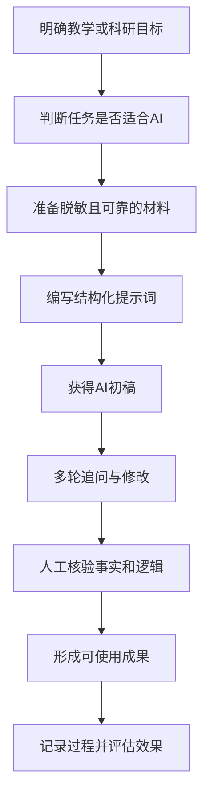

# 第五部分

## 风险治理与落地方案

54—60分钟

---

# AI 输出的四类常见风险

## 1. 事实错误

AI 可能生成看似合理但并不存在的事实。

## 2. 虚假引用

作者、题目、期刊、年份、DOI 可能被错误拼接。

## 3. 逻辑过度推断

AI 可能把相关关系说成因果关系。

## 4. 偏见与不公平

训练数据中的偏见可能影响内容、评价和推荐。


所有重要信息都必须经过教师或研究者核验。


---

# 学术诚信与教师责任

使用 AI 时建议明确：

- 哪些环节使用了 AI；
- AI 生成内容是否经过人工核验；
- 参考文献是否逐条查证；
- 数据和代码是否真实可复现；
- 学生是否被允许使用 AI；
- 学生使用 AI 是否需要披露；
- AI 是否参与了评分或决策。

## 一个基本原则

> **AI 可以是工具，但不能成为责任主体。**

最终的教学判断、学术判断和评价责任仍由教师承担。

---

# 数据安全与隐私保护

## 不建议直接上传

- 学生姓名、学号、联系方式
- 学生成绩和评价记录
- 未公开的研究数据
- 病例、访谈和敏感个人资料
- 未发表论文和项目申请书
- 涉及商业秘密的材料
- 受版权限制且未经授权的全文

## 使用前的处理方式

- 去标识化
- 删除无关信息
- 使用摘要或片段
- 采用校内或合规平台
- 核对平台的数据政策
- 保存处理记录

---

# AI 使用的“六步核验法”

```text
1. 看来源：信息来自哪里？
2. 查原文：能否回到原始材料？
3. 对事实：数据、日期、名称是否准确？
4. 查逻辑：结论是否超出证据？
5. 看边界：是否存在伦理、隐私或版权问题？
6. 留记录：是否保留提示词、版本和修改过程？
```


不要问：“AI 说得像不像真的？”

要问：“我能否用可靠证据验证它？”


---

# 30天 AI 教学科研行动计划

## 第1周：选择一个低风险任务

例如：

- 生成课堂讨论题；
- 优化一份教学大纲；
- 整理公开文献摘要；
- 润色一段已完成的文字。

## 第2周：建立提示词模板

记录：

- 任务背景；
- 使用的提示词；
- AI 输出；
- 人工修改；
- 最终效果。

## 第3周：嵌入工作流程

将 AI 放入备课、反馈或文献阅读流程中。

## 第4周：评估与改进

比较：

- 节省了多少时间？
- 输出质量是否提高？
- 哪些环节仍需人工完成？
- 是否产生新的风险？

---

# 一个适合教师的 AI 工作流



---

# 关键内容回顾


- AI 最适合处理重复、结构化和可检查的任务；
- 高质量提示词需要角色、任务、背景、约束和输出格式；
- 教学中可以用于备课、案例、互动、评价和反馈；
- 科研中可以用于文献整理、研究设计、代码辅助和语言润色；
- AI 输出必须经过事实、逻辑、引用和伦理核验；
- 不能上传敏感信息、未公开材料和未经授权的内容；
- 教师始终对教学质量、学术结论和学生评价负责。

