# 判断一个任务是否适合使用 Agent

主要看以下几个方面：
- 是否需要理解自然语言和用户意图；
- 是否需要调用多个工具或系统；
- 是否需要根据条件进行动态决策；
- 是否需要多步骤执行；
- 是否允许出现错误，是否涉及高风险操作；
- 是否需要人工确认或审批。

|任务|	是否适合使用 Agent|	更合适的实现方式|
|----|--|--|
|查询员工报销制度|	部分适合	|知识库问答或轻量 Agent|
|自动查询天气并安排出行|	适合	|多工具协同 Agent|
|分析销售数据并生成报告	|适合|	数据分析 Agent|
|自动审批所有财务申请|	不适合完全自动化|	规则引擎 + Agent 辅助 + 人工审批|
|根据客户需求推荐产品|	适合	|推荐型 Agent|

1. 适合直接使用 Agent 的任务
- 自动查询天气并安排出行；
- 分析销售数据并生成报告；
- 根据客户需求推荐产品。
这些任务都需要信息理解、工具调用、多步骤处理和动态决策。
2. 适合使用轻量 Agent 或知识库系统的任务
- 查询员工报销制度。
如果只是查制度，知识库问答就足够；如果还需要结合员工身份、费用、地区和审批流程进行判断，则可以升级为 Agent。
3. 不适合完全自动化，但适合 Agent 辅助的任务
- 自动审批所有财务申请。
- Agent 可以负责资料检查、规则匹配、风险识别和审批建议，但涉及资金、合规和责任的最终决策，应保留人工审批和审计机制。
总体上，Agent 最适合“需要理解、判断、调用工具并完成多个步骤”的任务；对于高风险、高责任的决策，应采用“Agent 辅助 + 规则约束 + 人工确认”的模式。

# AI Agent的基本结构
- 用户输入；
- 所需知识；
- 可用工具；
- Agent 决策步骤；
- 最终输出。

出差助手 Agent 模块	主要内容

- 用户输入：	出差人员、地点、时间、事由、交通、费用、项目等
- 所需知识：	差旅制度、审批规则、组织架构、预算规则、日期规则、合规要求
- 可用工具：	员工查询、政策查询、预算计算、项目校验、申请创建、审批提交、状态查询、通知工具
- Agent决策步骤：	理解意图 → 提取信息 → 补齐字段 → 查政策 → 算预算 → 做合规检查 → 生成草稿 → 用户确认 → 创建并提交
- 最终输出：	政策说明、预算结果、申请草稿、风险提醒、申请单号、审批状态

# 常见Agent工作流模式
## 1. 基础 Agent 工作流：感知—思考—行动

这是最基础的 Agent 循环，适合说明 Agent 如何接收任务、进行推理、调用工具并返回结果。

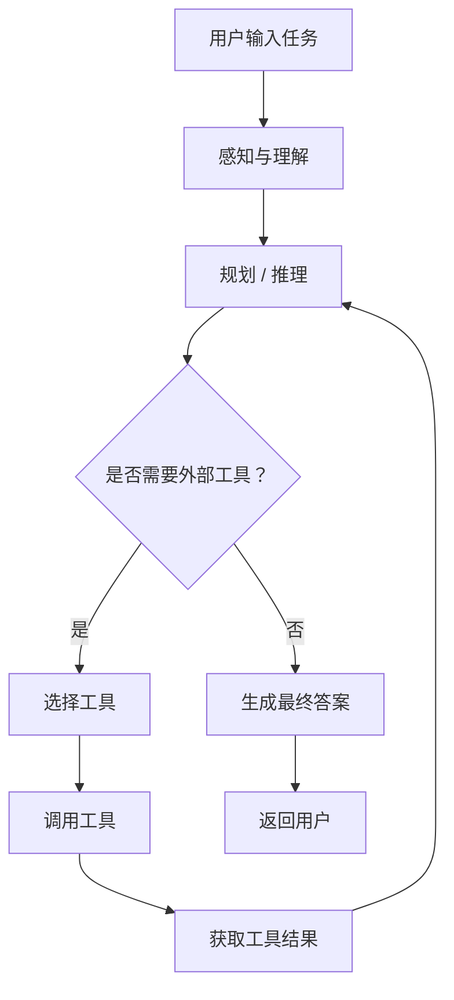

### 特点

- 结构简单，适合单轮或多轮任务。
- Agent 可以根据中间结果决定是否调用工具。
- 工具结果会反馈给推理模块，形成循环。
- 缺点是规划、执行、校验通常混在一起，复杂任务中可控性较弱。

---

## 2. ReAct 模式：推理与行动交替

ReAct，即 Reasoning + Acting，是最经典的 Agent 模式之一。Agent 在每一轮中交替进行思考、行动和观察。

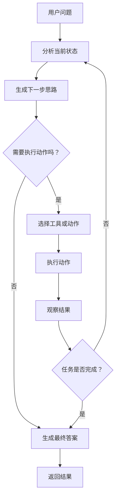

### 典型循环

```text
Thought → Action → Observation → Thought → Action → ...
```

### 适用场景

- 搜索问答
- 数据库查询
- 浏览器操作
- API 调用
- 需要根据工具返回结果动态决策的任务

### 优点与缺点

优点：

- 灵活性高。
- 可以根据实时结果动态调整策略。
- 适合开放式任务。

缺点：

- 容易出现无限循环。
- 推理过程可能不稳定。
- 工具调用次数和成本较难控制。
- 需要设置最大步数、超时和异常处理。

---

## 3. Plan-and-Execute：先规划，后执行

Plan-and-Execute 模式将“任务分解”和“具体执行”分离。适用于复杂、多步骤、目标明确的任务。

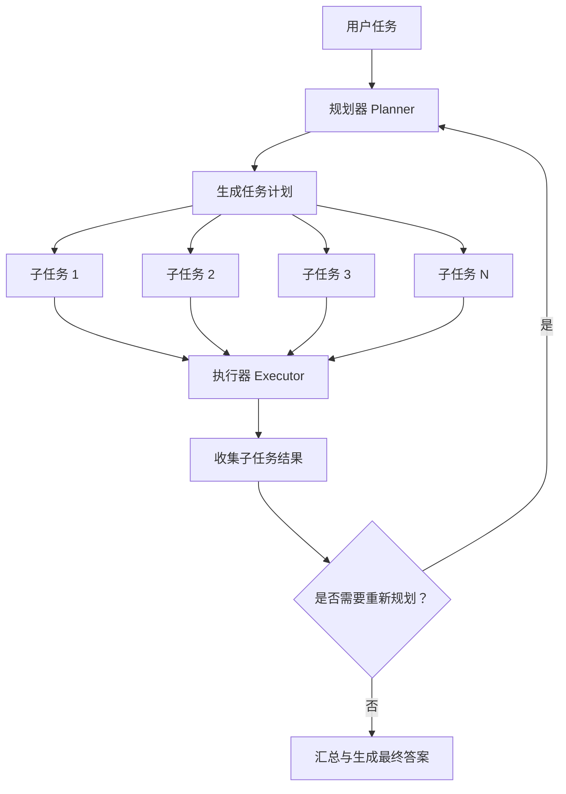

### 常见变体

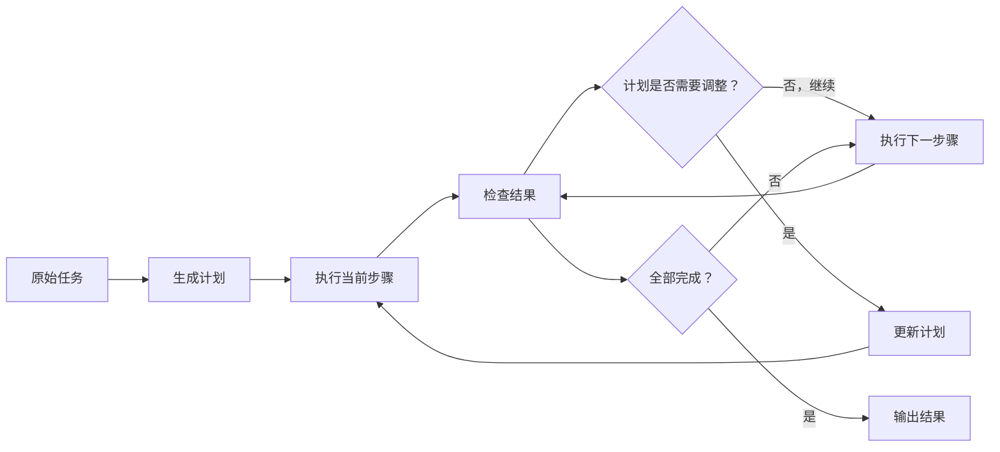

### 适用场景

- 研究报告生成
- 软件项目任务拆解
- 复杂数据分析
- 多步骤自动化
- 需要明确展示执行计划的任务

### 优点

- 任务结构清晰。
- 便于监控每个步骤。
- 支持失败重试和局部恢复。
- 便于人工审核计划。

### 缺点

- 初始计划可能不准确。
- 如果环境变化较大，需要动态重规划。
- 简单任务使用该模式可能增加不必要的开销。

---

## 4. Router 模式：任务路由到专用 Agent

Router 模式由一个路由器判断用户意图，并将任务分发给不同的专家 Agent 或处理链。

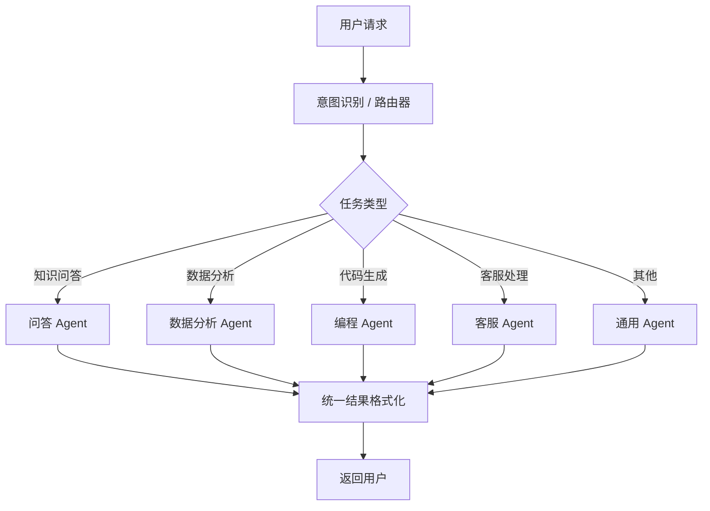

### 带置信度和人工兜底的 Router

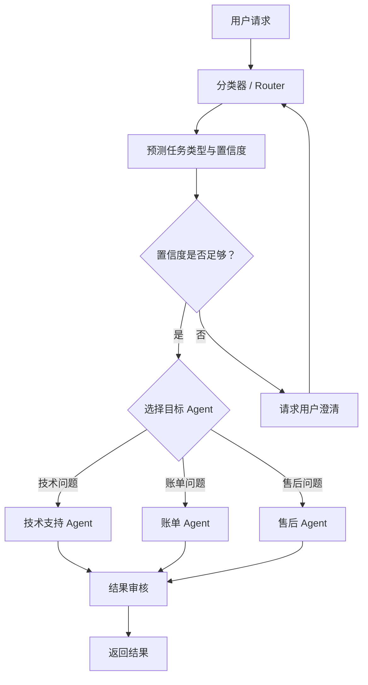

### 适用场景

- 企业客服
- 多领域知识问答
- 多业务系统入口
- 多 Agent 平台
- 不同任务需要不同提示词、工具和权限的场景

---

## 5. 并行 Agent 模式：多个 Agent 同时处理

当一个任务可以拆成互相独立的子任务时，可以让多个 Agent 并行执行，从而减少整体耗时。

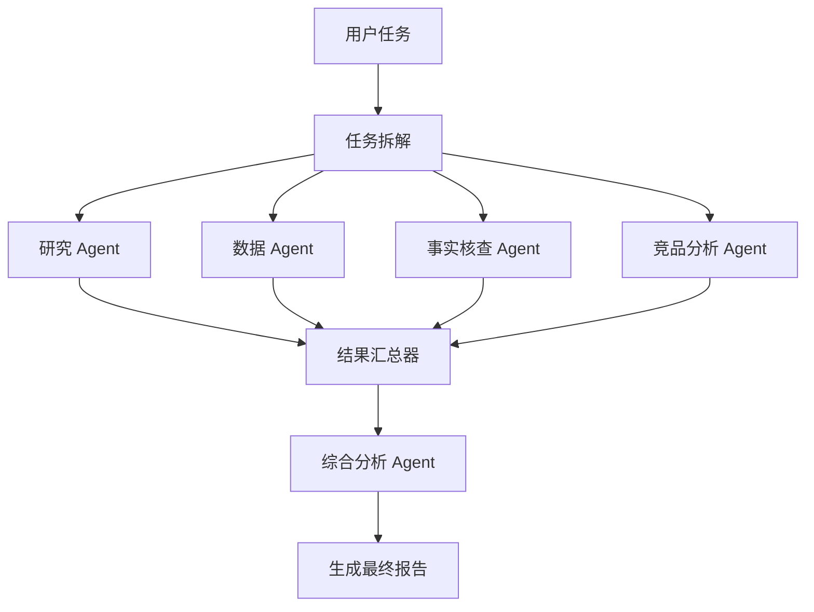

### 带失败处理的并行模式

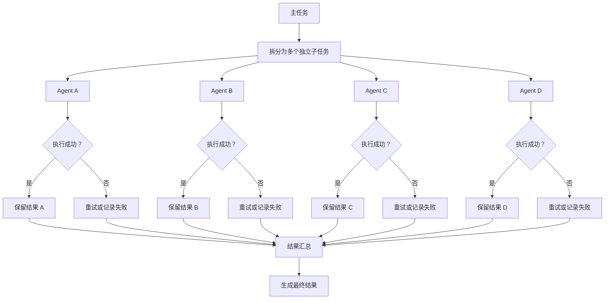

### 适用场景

- 多来源资料搜集
- 多维度分析
- 批量文档处理
- 多个独立 API 查询
- 多模型交叉判断

### 注意事项

- 子任务之间必须尽量独立。
- 需要处理超时、部分失败和重复执行。
- 汇总器需要解决结果冲突问题。
- 并行执行会增加资源消耗和调用成本。

---

## 6. Reflection / Self-Correction：生成—评审—修正

Reflection 模式让一个 Agent 或多个 Agent 对初始结果进行评审，并根据反馈持续改进。

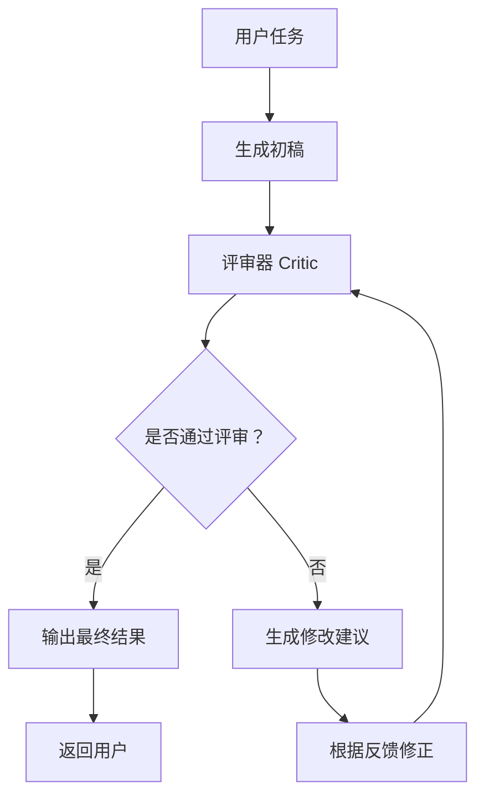

### 双 Agent 评审模式

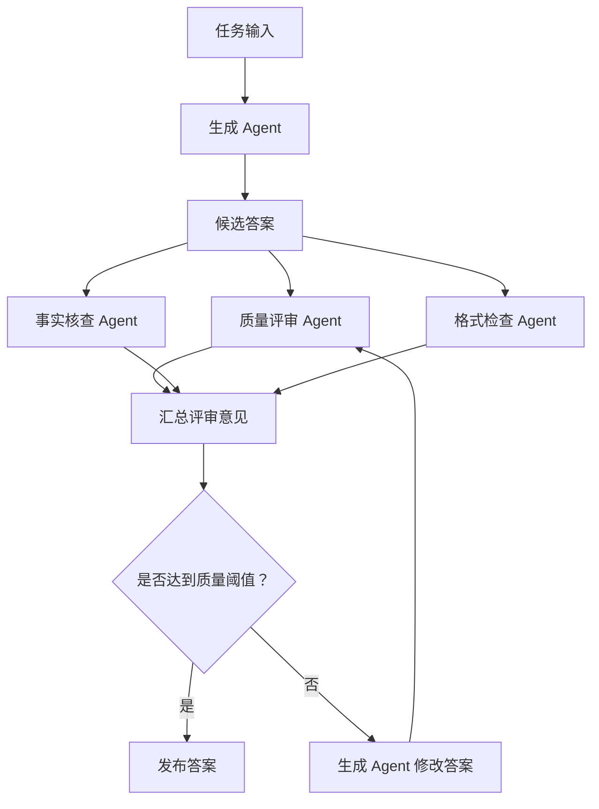

### 适用场景

- 长文写作
- 代码生成与修复
- 结构化报告
- 法律、医疗、金融等高风险内容
- 需要提高准确率和格式一致性的场景

### 常见评审指标

- 事实正确性
- 任务完成度
- 逻辑一致性
- 格式规范
- 安全性
- 引用完整性
- 是否包含幻觉内容

---

## 7. Supervisor 多 Agent 协作模式

Supervisor 模式由一个主管 Agent 负责拆分任务、分配工作、收集结果和协调多个专家 Agent。

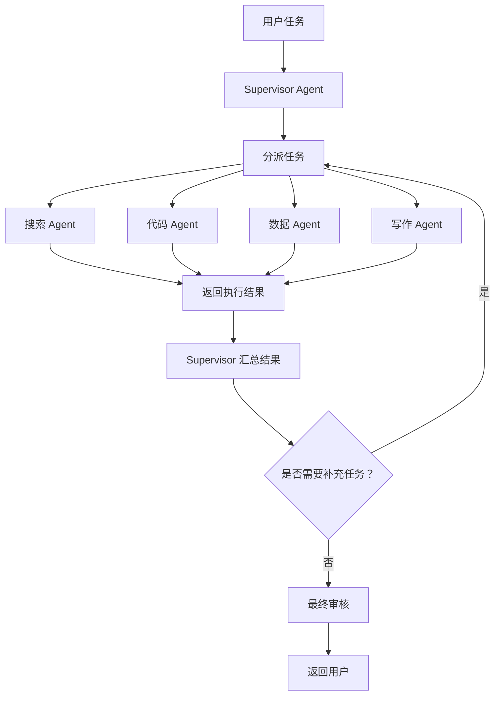

### Supervisor 负责的内容

- 任务拆解
- Agent 选择
- 参数传递
- 上下文管理
- 结果合并
- 冲突解决
- 失败重试
- 最终决策

### 适用场景

- 多角色协作
- 软件开发 Agent 团队
- 复杂研究工作流
- 需要动态调度多个工具和专家的任务

### 与 Router 的区别

| 模式 | 核心逻辑 |
|---|---|
| Router | 通常选择一个最合适的处理 Agent |
| Supervisor | 可以连续调度多个 Agent，并根据中间结果动态决策 |

---

## 8. Human-in-the-Loop：人工审批工作流

在高风险或不可逆操作前暂停流程，请求人工确认。

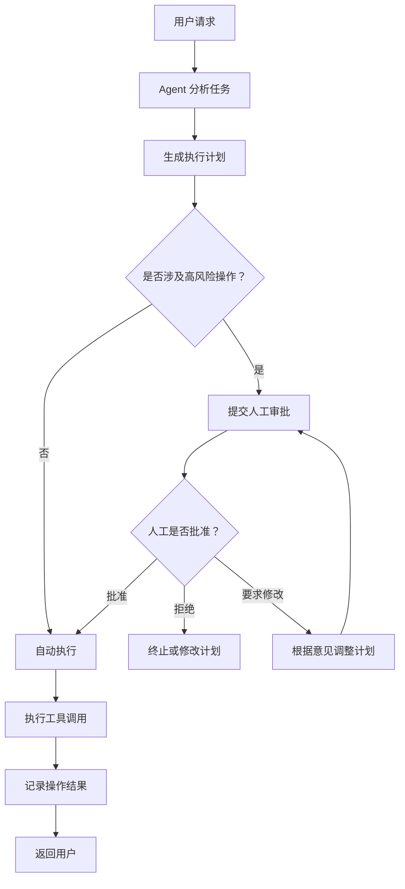

### 典型需要人工审批的操作

- 删除数据
- 发送邮件或消息
- 发布文章
- 执行支付
- 修改生产环境
- 提交法律或财务文件
- 对外发布敏感结论
- 访问高权限系统

### 推荐设计

人工审批节点应清楚展示：

- Agent 准备执行什么操作
- 使用了哪些参数
- 可能产生什么影响
- 是否可以撤销
- 审批人是谁
- 审批超时时如何处理

---

## 9. RAG Agent：检索增强生成

RAG Agent 会先判断是否需要检索知识库，然后进行查询、重排、生成答案和引用校验。

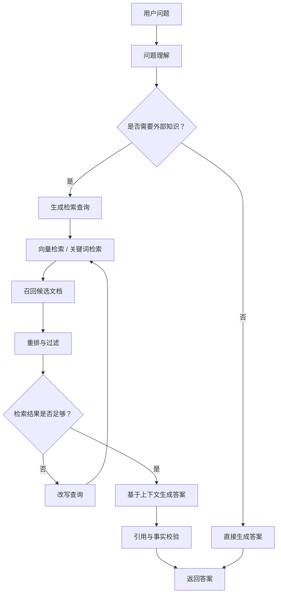

### RAG Agent 中常见的工具

- 向量数据库
- 全文搜索引擎
- 文档解析器
- 重排序模型
- 知识图谱
- SQL 查询工具
- 网页搜索工具

---

## 10. 工具调用与异常恢复模式

实际 Agent 通常需要处理工具调用失败、超时、参数错误和权限问题。

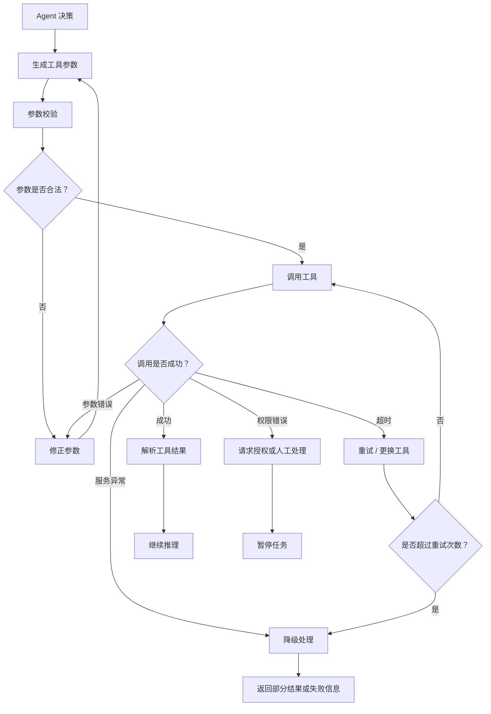

### 生产环境中建议设置

- 最大推理步数
- 最大工具调用次数
- 单次调用超时时间
- 总体任务超时时间
- 最大重试次数
- 指数退避
- 幂等键
- 工具调用审计日志
- 失败降级策略
- 敏感参数脱敏

---

# 综合型 Agent 工作流示例

下面是一个将路由、规划、并行执行、工具调用、评审和人工审批结合起来的综合流程。

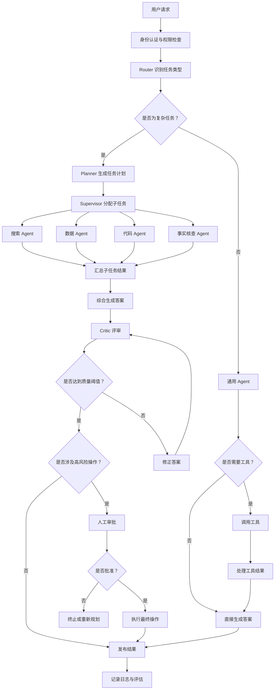

---

# 常见 Agent 工作流模式对比

| 模式 | 核心特点 | 适合场景 |
|---|---|---|
| 基础 Agent 循环 | 感知、推理、行动循环 | 简单工具调用 |
| ReAct | 推理与行动交替 | 搜索、浏览器、动态决策 |
| Plan-and-Execute | 先规划再执行 | 复杂多步骤任务 |
| Router | 按任务类型分发 | 多领域、多业务入口 |
| 并行 Agent | 多个 Agent 同时工作 | 独立子任务、批处理 |
| Reflection | 生成后自我评审和修正 | 写作、代码、报告 |
| Supervisor | 主管调度多个专家 | 多 Agent 协作 |
| Human-in-the-Loop | 关键节点人工确认 | 高风险、不可逆操作 |
| RAG Agent | 检索外部知识后生成 | 企业知识库、文档问答 |
| 异常恢复 | 重试、降级、人工介入 | 生产级工具调用 |

---

# 设计 Agent 工作流时的通用建议

1. **简单任务优先使用简单流程**  
   不要为了使用多 Agent 而引入复杂架构。

2. **明确状态和上下文**  
   每一步最好记录：
   - 当前任务状态
   - 已完成步骤
   - 工具调用结果
   - 错误信息
   - 剩余预算和时间

3. **为循环设置边界**

   ```text
   最大步数
   最大重试次数
   最大工具调用次数
   最大 Token 消耗
   最大执行时间
   ```

4. **工具调用必须可审计**  
   记录工具名称、参数、返回值摘要、调用者和时间。

5. **高风险操作增加人工审批**  
   尤其是支付、删除、发布、生产环境变更等操作。

6. **支持部分失败**  
   并行任务中不应因为一个子任务失败就导致全部结果丢失。

7. **区分规划失败和执行失败**
   - 规划失败：重新拆解任务。
   - 执行失败：重试、替换工具或降级。
   - 结果质量失败：进入 Reflection 流程。

8. **加入可观测性**
   建议监控：
   - 平均任务耗时
   - Agent 步数
   - 工具调用成功率
   - 重试率
   - 人工介入率
   - 最终任务完成率
   - Token 和费用消耗

9. **统一输出格式**
   多 Agent 协作时，建议使用结构化结果，例如：

   ```json
   {
     "status": "success",
     "summary": "任务摘要",
     "evidence": [],
     "warnings": [],
     "next_action": null
   }
   ```

10. **将不可控的自由推理转换为可控状态机**
    对生产系统而言，通常推荐：

    ```text
    状态定义
    → 节点定义
    → 转移条件
    → 工具权限
    → 超时与重试
    → 审批节点
    → 结果校验
    ```


