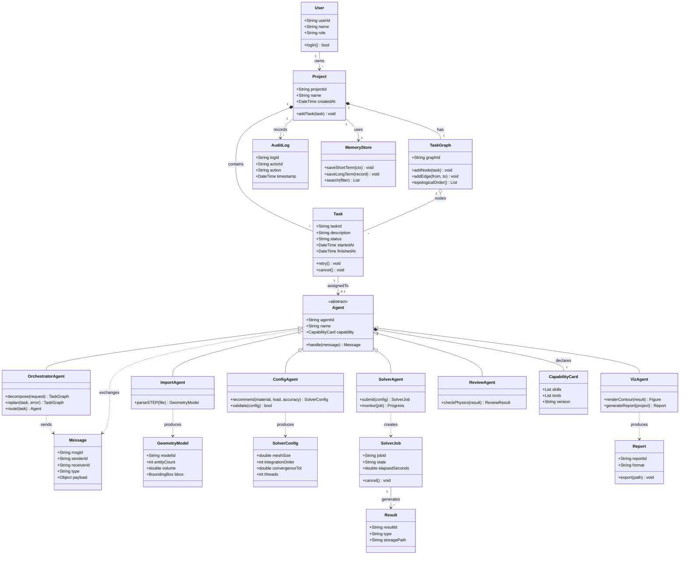

# 多智能体 AI Agent 工业分析平台：软件功能规格说明书（示例）

> 本示例描述一个由多个 LLM 驱动的智能体协同完成工业仿真分析任务的系统。AI Agent 通常指由大模型驱动、具备理解需求、规划任务、调用工具和执行落地能力的智能系统[2]。多智能体系统则把复杂任务拆分给不同角色的 Agent 分工协作，这一思路与 MetaGPT 等多角色软件 Agent 的设计相近[4]。

## 0. 文档信息

| 项目 | 内容 |
|---|---|
| 系统名称 | 工业分析多智能体平台（IAMAS，Industrial Analysis Multi-Agent System） |
| 版本 | v1.0 草案 |
| 适用范围 | 工业仿真数据导入、算法配置、有限元求解与结果分析 |
| 编号规则 | FR-x.y 为功能需求，NFR-x 为非功能需求，AG-x 为智能体角色 |

## 1. 系统角色 (Actor)

### 1.1 人类角色
* **工业分析师**：提交自然语言分析需求，审核 Agent 给出的方案，执行结果确认与导出。
* **系统管理员**：管理用户与权限，配置 Agent 与工具的注册信息，审计 Agent 操作日志。

### 1.2 系统外部角色
* **大模型服务 (LLM Provider)**：提供推理能力，供各 Agent 调用。
* **求解器服务 (Solver Service)**：执行有限元方程组求解的外部计算引擎。
* **文件存储服务**：保存 STEP 模型文件、中间结果与报告。

### 1.3 智能体角色 (Agent Roles)

| 编号 | 智能体 | 职责 | 主要工具 |
|---|---|---|---|
| AG-1 | 协调智能体 (Orchestrator) | 解析需求、拆分任务图、调度其他 Agent、处理失败重规划 | 任务图引擎、消息总线 |
| AG-2 | 数据导入智能体 (ImportAgent) | 解析 STEP 文件，校验几何与网格质量 | STEP 解析器 |
| AG-3 | 算法配置智能体 (ConfigAgent) | 根据材料、载荷与精度要求推荐求解参数 | 参数知识库、校验规则 |
| AG-4 | 求解智能体 (SolverAgent) | 提交并监控求解任务，收集求解状态 | 求解器服务接口 |
| AG-5 | 可视化智能体 (VizAgent) | 生成云图、曲线等图表，撰写分析报告 | 绘图库、报告模板 |
| AG-6 | 质检智能体 (ReviewAgent) | 检查结果合理性（如守恒性、收敛性），输出质检结论 | 物理规则库 |

## 2. 功能树 (Feature Tree)

* **2.1 任务编排模块 (Orchestration)**
  * FR-1.1：支持接收自然语言形式的分析需求，并将其解析为结构化任务描述（JSON Schema 校验）。
  * FR-1.2：协调智能体根据任务描述生成有向无环图 (DAG)，标明各子任务的输入、输出与依赖关系。
  * FR-1.3：子任务执行失败时，协调智能体应基于错误信息进行重规划，单个任务最多重试 3 次，超过后升级为人工处理。
  * FR-1.4：同一 DAG 中互不依赖的子任务应并行调度。

* **2.2 智能体管理模块 (Agent Management)**
  * FR-2.1：管理员可注册、启用、停用 Agent，并维护每个 Agent 的能力描述（Capability Card）。
  * FR-2.2：Agent 之间通过统一的结构化消息总线通信，消息须包含发送方、接收方、任务 ID、类型与负载。
  * FR-2.3：协调智能体依据能力描述进行任务路由，无匹配 Agent 时返回明确错误。

* **2.3 模型导入模块 (Model Import)**
  * FR-3.1：支持 STEP 物理数据包（AP203/AP214/AP242）的几何解析与拓扑提取。
  * FR-3.2：对异常文件应具备鲁棒性容错，如缺失实体、坐标越界、非流形几何等，并将错误项写入日志并上报给协调智能体。
  * FR-3.3：导入完成后输出模型摘要（实体数、体积、包围盒）供后续 Agent 使用。

* **2.4 算法配置模块 (Algorithm Configuration)**
  * FR-4.1：配置智能体依据材料属性、边界条件与精度目标推荐求解参数（网格尺寸、积分阶次、收敛阈值等）。
  * FR-4.2：所有推荐参数须经规则库校验（取值范围、单位一致性），不合规时拒绝并给出修正建议。
  * FR-4.3：推荐方案需经分析师确认后方可进入求解阶段（见 FR-8.3）。

* **2.5 求解器模块 (Solver)**
  * FR-5.1：支持并行化有限元方程组求解（支持 OpenMP 多线程并行，可配置线程数）。
  * FR-5.2：实时返回求解进度、迭代残差与资源占用情况，支持任务暂停与取消。
  * FR-5.3：求解超过预设时限（默认 2 小时）时自动终止并保存中间状态。

* **2.6 结果分析与可视化模块 (Analysis & Visualization)**
  * FR-6.1：生成应力、位移、温度等场量云图及关键节点时程曲线。
  * FR-6.2：质检智能体对结果执行物理合理性检查（如力平衡误差、收敛判据），输出质检报告。
  * FR-6.3：自动生成包含结论、图表与参数记录的分析报告，支持导出 PDF 与 DOCX。

* **2.7 记忆与知识模块 (Memory & Knowledge)**
  * FR-7.1：会话级短期记忆，保存当前任务的上下文与中间结论。
  * FR-7.2：项目级长期记忆，保存历史参数方案与分析结论，供配置智能体检索复用。
  * FR-7.3：记忆检索应支持按项目、材料类型与时间范围过滤。

* **2.8 权限与审计模块 (Security & Audit)**
  * FR-8.1：基于角色的访问控制 (RBAC)，区分工业分析师与系统管理员的操作权限。
  * FR-8.2：记录所有 Agent 的调用、工具请求与输出，形成不可篡改的审计日志。
  * FR-8.3：高风险操作（如提交大规模求解、删除模型数据、修改全局参数）必须经人工审批（Human-in-the-loop）后才能执行。

## 3. 非功能需求 (Non-Functional Requirements)

| 编号 | 类别 | 需求描述 |
|---|---|---|
| NFR-1 | 性能 | 单个 STEP 文件（不超过 200 MB）解析时间不超过 60 秒 |
| NFR-2 | 性能 | 协调智能体完成任务拆分的响应时间不超过 10 秒（不含大模型排队时间） |
| NFR-3 | 可靠性 | 单个 Agent 异常不应导致整个 DAG 崩溃，需支持断点续跑 |
| NFR-4 | 可扩展性 | 新 Agent 通过注册机制接入，无需修改协调智能体代码 |
| NFR-5 | 可观测性 | 提供每个 Agent 的调用耗时、Token 消耗与错误率监控面板 |
| NFR-6 | 安全性 | Agent 调用外部工具需经白名单校验，禁止执行未授权的系统命令 |
| NFR-7 | 可追溯性 | 每份分析报告须可追溯至具体的模型版本、参数方案与 Agent 执行记录 |

## 4. 典型业务流程（摘要）

1. 分析师提交需求："对某 STEP 支架模型进行静力分析，材料为 Q345，底面固定，顶面施加 10 kN 载荷。"
2. 协调智能体 (AG-1) 解析需求，生成 DAG：导入 → 配置 → 求解 → 可视化 → 质检。
3. 数据导入智能体 (AG-2) 解析模型并返回摘要；若发现异常，按 FR-3.2 上报。
4. 配置智能体 (AG-3) 检索长期记忆中的相似方案，给出参数推荐，分析师确认（FR-4.3）。
5. 求解智能体 (AG-4) 并行提交求解任务，实时回传进度（FR-5.2）。
6. 可视化智能体 (AG-5) 生成云图与报告；质检智能体 (AG-6) 完成合理性检查。
7. 分析师审阅并导出报告，全部操作写入审计日志（FR-8.2）。

## 5. 领域模型 (Domain Model UML)

## 6. 验收标准（摘要）

* 给定标准 STEP 测试集，导入成功率不低于 98%，异常文件均被正确识别并上报。
* 在 8 核环境下，并行求解相较单线程的加速比不低于 4 倍（测试模型规模固定）。
* 人为注入单个 Agent 故障时，DAG 能在不重启全流程的前提下完成断点续跑。
* 审计日志覆盖率达到 100%，高风险操作在未审批时无法执行。

---

## 参考链接

- [1] AI Agent - hong6234 - 博客园：https://www.cnblogs.com/hong6234/p/19701489
- [2] AI Agent - 福寿螺888 - 博客园：https://www.cnblogs.com/Python888/p/19403414
- [3] 解析AI Agent，原理、应用与代码示例 - CSDN：https://m.blog.csdn.net/Java_ZZZZZ/article/details/146115548
- [4] 互联网行业 AI Agent 智能体产品方案与技术实现 - CSDN博客：https://blog.csdn.net/xiaofeng10330111/article/details/163677123
- [5] 什么是 AI Agent？原理、应用与代码示例 - CSDN：https://m.blog.csdn.net/luwei42768/article/details/145232598
- [6] 大模型智能体Ai Agent原理解析 - boardmix博思白板：https://boardmix.cn/community/fpwEJ7uKo_4mmW-7ptiQWw/
