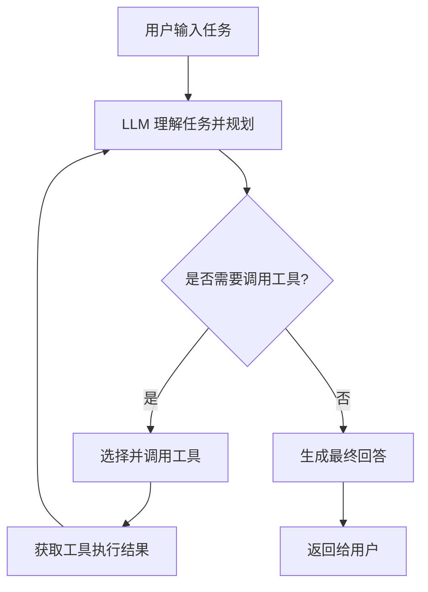
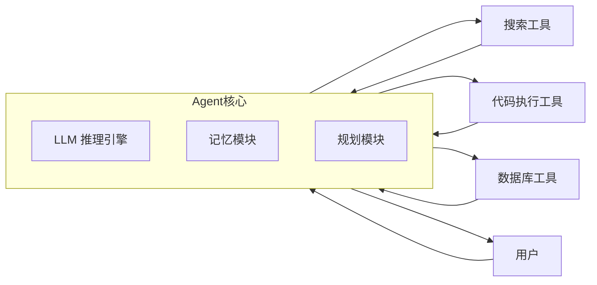

# AI Agent 开发入门指南

## 一、什么是 AI Agent

AI Agent（智能体）是以大语言模型（LLM）为"大脑"，能够自主感知环境、进行推理规划、调用工具、执行动作，并根据反馈不断调整行为以完成特定目标的智能系统。与普通的"一问一答"式聊天机器人不同，Agent 具备**自主性**、**工具使用能力**和**多步骤任务执行能力**，例如自动查资料、写代码、订机票、管理日程等。

一个典型的 Agent 系统通常包含以下核心模块：

| 模块 | 作用 |
|---|---|
| 大语言模型（LLM） | 负责理解任务、进行推理与决策 |
| 记忆（Memory） | 保存历史对话、中间结果，支持长期任务 |
| 工具（Tools） | 让 Agent 能调用搜索、代码执行、数据库查询等外部能力 |
| 规划（Planning） | 将复杂任务拆解为可执行的子步骤 |
| 执行与反馈循环 | 执行动作后观察结果，决定下一步 |

## 二、Agent 的整体工作流程

下面用 Mermaid 流程图展示一个典型 Agent 的运行逻辑（感知—思考—行动—观察循环，即 ReAct 模式）：

这个循环会不断重复，直到 Agent 判断任务已经完成，或达到预设的最大步数。

## 三、开发步骤详解

### 第一步：明确任务与边界

在动手写代码之前，先想清楚 Agent 要解决什么具体问题、使用场景是什么、需要哪些外部数据或权限，以及什么情况下应该停止或拒绝执行。范围定义越清晰，后续设计越简单。

### 第二步：选择大语言模型

根据任务复杂度、成本预算和响应速度选择合适的模型（例如 Claude、GPT 系列等）。简单任务可用轻量模型，复杂推理任务建议使用能力更强的模型。

### 第三步：设计工具（Tools）

工具是 Agent 与外部世界交互的"手脚"。常见工具类型包括：

| 工具类型 | 示例 |
|---|---|
| 信息检索类 | 网页搜索、知识库查询 |
| 代码执行类 | 运行 Python 脚本、调用计算器 |
| 数据操作类 | 数据库读写、文件读写 |
| 外部 API 类 | 发邮件、查天气、下订单 |

每个工具需要清晰定义：名称、功能描述、输入参数格式、返回结果格式。描述写得越清楚，LLM 调用越准确。

### 第四步：设计记忆机制

短期记忆通常直接放在对话上下文中；长期记忆则可借助向量数据库（如 Chroma、Pinecone）存储历史信息，供后续检索使用（即 RAG，检索增强生成）。

### 第五步：搭建规划与推理逻辑

对于复杂任务，可以让 LLM 先输出一个任务拆解计划，再逐步执行每个子任务。常见模式包括 ReAct（推理+行动交替）、Plan-and-Execute（先规划再执行）等。

### 第六步：搭建执行与反馈循环

代码层面需要实现一个循环：LLM 输出 → 判断是否调用工具 → 调用工具并获取结果 → 将结果反馈给 LLM → 继续推理，直到任务完成。

### 第七步：加入安全与限制机制

设置最大执行步数、超时时间、危险操作的人工确认环节，避免 Agent 出现死循环或执行不可逆的危险操作。

### 第八步：测试与迭代

用真实场景反复测试，观察 Agent 在边界情况下的表现，调整提示词（Prompt）、工具描述和逻辑，持续优化准确率和稳定性。

## 四、常用开发框架对比

| 框架 | 特点 | 适合人群 |
|---|---|---|
| LangChain | 生态成熟，工具链丰富 | 需要快速搭建原型的开发者 |
| LangGraph | 支持复杂状态机式的多步骤流程 | 需要精细控制流程的开发者 |
| AutoGen | 支持多 Agent 协作对话 | 需要多角色分工协作的场景 |
| 直接调用模型 API + 自建循环 | 灵活度最高，无框架依赖 | 有一定编程基础、追求轻量化的开发者 |

## 五、一个简化的整体架构图

## 六、给初学者的建议

初学者不必一开始就追求功能齐全的复杂系统，建议从一个只有一到两个工具的最小可用版本入手，先跑通"输入—推理—调用工具—输出"的完整闭环，再逐步增加工具种类、记忆能力和安全限制。多观察 Agent 在真实任务中的失败案例，往往比阅读理论更能帮助理解如何优化提示词和流程设计。
