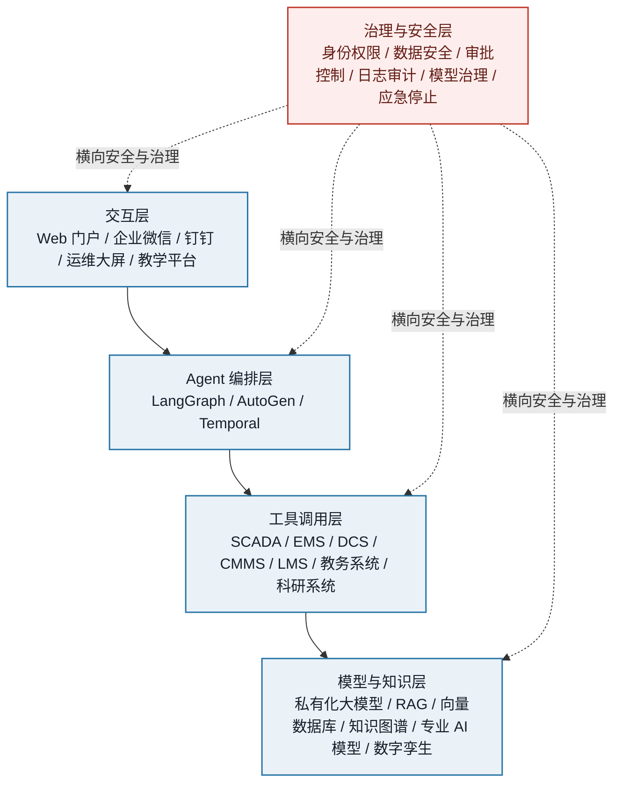

# Agent类型

| 类型 | 工作方式 | 适用场景 | 主要特点 |
|---|---|---|---|
| 被动响应型 Agent | 接收用户明确指令后执行单次任务，不主动规划，也不会持续跟踪任务状态 | 问答、信息检索、文本生成、简单数据查询、客服 FAQ | 自主程度最低；响应速度快；行为可控；通常不具备长期记忆和连续执行能力 |
| 辅助决策型 Agent（Copilot） | 在用户主导下提供建议、草稿、分析结果或操作辅助，由用户确认后完成最终决策和执行 | 编程辅助、文档撰写、销售支持、数据分析、办公自动化 | 人机协作；用户拥有最终控制权；能够理解上下文并提供个性化建议；适合高风险或需要人工审核的任务 |
| 任务执行型 Agent | 用户给出目标后，Agent 会自行拆解任务、调用工具并执行多个步骤，但通常需要关键节点确认 | 自动生成报表、数据清洗、部署应用、处理工单、执行标准业务流程 | 具备一定规划和工具调用能力；可连续执行任务；在关键操作前通常需要人工审批；兼顾效率与可控性 |
| 半自主型 Agent | 仅需接收较高层次的目标，能够自主规划、执行、监控和调整任务，遇到异常或高风险情况时请求人工介入 | 复杂数据工程、自动化运维、研究分析、供应链管理、营销活动编排 | 自主程度较高；具备状态跟踪、错误恢复和动态调整能力；采用“人在回路中”机制；适合流程较复杂但仍需监督的任务 |
| 全自主型 Agent | 根据目标或约束条件独立完成任务，包括规划、决策、工具调用、执行、评估和迭代，通常无需人工逐步干预 | 长时间运行的监控系统、自动化交易模拟、虚拟企业运营、复杂科研探索、无人化流程 | 自主程度最高；能够持续运行和自我调整；对环境感知、记忆、规划和安全控制要求高；存在误操作、目标偏离和合规风险 |
| 多 Agent 协作系统 | 多个具有不同职责的 Agent 分工协作，由协调 Agent 或通信机制分配任务、汇总结果和处理冲突 | 软件研发团队模拟、复杂研究项目、端到端业务流程、跨部门自动化 | 通过角色分工提升复杂任务处理能力；可并行执行；系统设计和协作成本较高；需要统一权限、通信和结果校验机制 |

以下方案默认：**高风险操作均采用“人在回路中”机制，Agent 可以生成建议、编排任务和提交申请，但涉及控制、工单关闭、成绩发布、科研任务提交等操作必须经过授权审批。**

# 能源领域：

能源领域的 Agent 可以围绕 **PHM、PEM、PQM** 构建，并与 SCADA、EMS、DCS、CMMS、数据平台、设备管理系统和生产管理系统集成。

| Agent类型 | 典型场景 | 推荐技术 |
|---|---|---|
| 被动响应型 Agent | **能源知识问答 Agent**：查询设备运行规程、检修手册、事故案例、操作票、技术标准和监管要求。支持运维人员查询“某类告警的含义”“某设备的检修步骤”“某类故障的历史案例”。 | 私有化大模型；RAG；LangChain 或 LlamaIndex；Elasticsearch、OpenSearch 或 Milvus 向量检索；文档解析和权限过滤；与 SCADA、DCS、CMMS 的只读 API 集成 |
| 被动响应型 Agent | **设备运行数据查询 Agent**：根据自然语言查询风机、光伏逆变器、储能电池、锅炉、汽轮机、变压器、制氢设备等的历史运行数据、告警记录、维修记录和性能指标。 | LangChain/LlamaIndex；SQL Agent；时序数据库查询；数据库权限控制；语义层；统一指标口径；与 InfluxDB、TimescaleDB、IOTDB 或数据湖集成 |
| 被动响应型 Agent | **告警解释 Agent**：对 SCADA、EMS、DCS 中的设备告警进行解释，关联运行工况、历史告警和操作规程，给出可能原因及建议检查项。 | RAG；规则引擎；知识图谱；时序数据分析模型；告警压缩和告警关联算法；LangGraph 可用于多步骤查询流程 |
| 辅助决策型 Agent（Copilot） | **PHM 故障诊断 Copilot**：综合振动、温度、电流、电压、压力、油液、声学和告警数据，辅助判断设备健康状态、可能故障模式和故障发展趋势。适用于风机齿轮箱、光伏逆变器、储能电芯、锅炉辅机、汽轮机、变压器等。 | LangGraph；时序异常检测模型；剩余寿命预测模型；故障树和专家规则；XGBoost、LightGBM、Transformer、时序基础模型；RAG；模型解释工具；人工确认后进入 CMMS |
| 辅助决策型 Agent（Copilot） | **预测性维护方案 Copilot**：根据 PHM 结果、设备重要度、备品备件库存、历史维修成本和停机窗口，生成维护策略、检修优先级、工时估算和备件需求。 | LangGraph；CMMS/EAM API；优化算法；规则引擎；知识图谱；RAG；OR-Tools 或其他运筹优化工具；人工审批后自动创建维修工单 |
| 辅助决策型 Agent（Copilot） | **PEM 生产效率分析 Copilot**：分析风电可利用率、光伏 PR、储能充放电效率、火电热效率、核电辅助系统效率、制氢能耗、输配电损耗等指标，识别效率损失原因并提出改进建议。 | LangGraph；时序分析；能效基线模型；数字孪生；因果分析；数据质量检测；优化模型；与 EMS、DCS、SCADA 和生产管理系统集成 |
| 辅助决策型 Agent（Copilot） | **PQM 生产质量分析 Copilot**：分析电能质量、氢气纯度、锅炉蒸汽品质、储能电池一致性、光伏组件质量、设备制造质量和生产过程偏差，辅助定位质量异常原因。 | LangGraph；SPC 统计过程控制；异常检测；质量规则引擎；因果分析；知识图谱；MES/QMS/SCADA 数据集成；RAG |
| 辅助决策型 Agent（Copilot） | **运行方式和调度分析 Copilot**：辅助分析负荷预测、新能源出力预测、储能策略、设备启停方案、检修安排和电力市场约束，输出多套运行方案供调度人员选择。 | LangGraph；预测模型；OR-Tools、Pyomo 或其他优化工具；数字孪生；EMS API；约束规则引擎；方案仿真和人工审批 |
| 任务执行型 Agent | **自动化 PHM 工单 Agent**：定期读取设备健康评分和故障预测结果，筛选高风险设备，自动生成诊断报告、维护建议、备件清单和 CMMS 工单草稿，经审批后提交。 | LangGraph；工作流编排；CMMS/EAM API；事件总线 Kafka 或 RabbitMQ；RAG；时序模型；审批流；审计日志；任务状态数据库 |
| 任务执行型 Agent | **生产日报和月报 Agent**：自动汇总 SCADA、EMS、DCS、CMMS 和生产系统数据，生成发电量、可利用率、设备故障、能效、质量和安全运营报告。 | LangGraph；SQL/时序数据库；报表生成；BI 工具；模板引擎；数据质量校验；定时调度；权限和版本管理 |
| 任务执行型 Agent | **PEM 参数优化建议 Agent**：根据目标产量、能耗、设备状态和运行约束，计算控制参数或运行策略的建议值，并提交给操作人员确认。 | LangGraph；优化算法；模型预测控制 MPC；数字孪生；规则引擎；DCS/EMS 接口；安全边界校验；审批后执行 |
| 任务执行型 Agent | **PQM 异常闭环 Agent**：发现生产质量偏差后，自动关联原料、工艺参数、环境条件、设备状态和历史案例，形成质量异常单，分派调查任务并跟踪整改。 | LangGraph；QMS/MES/SCADA 集成；根因分析；知识图谱；规则引擎；任务管理；人工确认节点；事件驱动架构 |
| 任务执行型 Agent | **设备数据治理 Agent**：自动发现传感器断点、异常值、量程错误、时间戳错位、设备编码不一致和数据漂移问题，生成修复任务或数据质量报告。 | LangGraph；Great Expectations、Deequ 等数据质量工具；时序数据库；数据血缘；规则引擎；Kafka；数据湖和元数据管理 |
| 半自主型 Agent | **风电场/光伏电站健康监控 Agent**：持续跟踪全场设备健康度，自动发现异常趋势，比较同型号设备表现，动态调整监控重点，并在达到风险阈值时请求人工介入。 | LangGraph；状态机；事件驱动架构；时序异常检测；设备群组建模；数字孪生；Kafka；Prometheus/Grafana；人工审批和升级机制 |
| 半自主型 Agent | **储能系统安全与寿命管理 Agent**：持续监控 SOC、SOH、温度、电压一致性、热失控风险和循环衰减，形成充放电策略建议、检修建议和风险升级通知。 | LangGraph；时序模型；电池状态估计模型；风险规则引擎；数字孪生；BMS/EMS 接口；安全策略和硬约束校验；人工确认 |
| 半自主型 Agent | **综合能源系统优化 Agent**：综合考虑电、热、冷、气、氢、储能和负荷，持续进行预测、方案生成、仿真、评估和调度建议。 | LangGraph 或 Temporal；多目标优化；Pyomo/OR-Tools；数字孪生；EMS/SCADA 接口；预测模型；约束求解；人工审批 |
| 半自主型 Agent | **检修资源协同 Agent**：根据设备风险、停机窗口、人员技能、备品备件、外委资源和安全要求，自动编排检修计划，并在异常情况下重新规划。 | LangGraph；OR-Tools；CMMS/EAM；库存系统；人员与技能数据库；工作流引擎；事件总线；异常恢复和审批机制 |
| 半自主型 Agent | **生产效率持续改进 Agent**：自动识别 PEM 指标下降、形成假设、调用数据分析工具验证原因、生成改进方案并跟踪改进效果。 | LangGraph；因果推断；时序分析；A/B 或对照分析；数字孪生；BI；实验设计；任务跟踪和人工评审 |
| 全自主型 Agent | **数字孪生仿真与策略评估 Agent**：在仿真环境中自主生成运行策略、执行多轮模拟、比较能效和风险，并输出推荐方案。该场景适合离线分析和沙盒环境。 | LangGraph；数字孪生平台；强化学习或模型预测控制；仿真引擎；优化算法；安全约束；模型评估和结果审计 |
| 全自主型 Agent | **低风险辅助系统自动运维 Agent**：对非关键、可回滚、具有明确安全边界的辅助系统进行自动巡检、参数校验和故障恢复。 | LangGraph 或 Temporal；AIOps；规则引擎；可回滚自动化脚本；策略引擎；Prometheus；安全沙箱；变更审批和全量审计 |
| 全自主型 Agent | **生产策略自动探索 Agent**：在历史数据和数字孪生环境中自动探索 PEM 或 PQM 改进策略，不直接作用于实际生产控制，仅输出经过验证的候选方案。 | 多 Agent 或 LangGraph；数字孪生；强化学习；贝叶斯优化；因果分析；仿真评估；模型治理；人工审批 |
| 多 Agent 协作系统 | **PHM 多 Agent 协作系统**：由数据诊断 Agent、故障机理 Agent、维修策略 Agent、备件 Agent、工单 Agent 和审批 Agent 协作完成“监测—诊断—预测—维护—验证”闭环。 | AutoGen 或 LangGraph Supervisor；事件总线；RAG；时序模型；知识图谱；CMMS/EAM API；统一身份认证；结果交叉验证 |
| 多 Agent 协作系统 | **PHM-PEM-PQM 综合运营 Agent**：由健康管理 Agent、效率管理 Agent、质量管理 Agent、调度 Agent、风险控制 Agent 和报告 Agent 协同，分析设备健康、生产效率和质量之间的影响。 | LangGraph Supervisor 或 AutoGen；多 Agent 通信协议；共享状态库；数字孪生；多目标优化；规则引擎；人工审批网关 |
| 多 Agent 协作系统 | **新能源场站运营 Agent 团队**：包括功率预测 Agent、设备健康 Agent、储能策略 Agent、功率质量 Agent、市场分析 Agent 和运维计划 Agent。 | LangGraph 适合可控流程编排；AutoGen 适合多角色讨论和任务协作；Kafka；EMS/SCADA/CMMS 接口；优化工具；策略审计 |
| 多 Agent 协作系统 | **电力交易与综合能源运营分析系统**：市场预测 Agent、负荷预测 Agent、发电预测 Agent、储能优化 Agent、风险评估 Agent 和合规审核 Agent 协同生成交易或调度建议。 | AutoGen 或 LangGraph；预测模型；优化求解器；市场规则知识库；数字孪生；仿真系统；审批流；不可篡改审计日志 |

### 能源领域技术选型建议

- **LangGraph**：适合 PHM、PEM、PQM 这类需要明确步骤、状态跟踪、人工审批、异常分支和可恢复执行的流程。
- **AutoGen**：适合多个专家角色进行方案讨论、故障会诊、生产策略评审和跨专业协作。
- **Temporal**：适合长周期、可重试、可恢复的工单、检修、审批和生产运营流程。
- **LlamaIndex/LangChain**：适合构建设备手册、规程、历史案例和标准规范的 RAG 应用。
- **Kafka/RabbitMQ**：适合接收 SCADA、EMS、DCS、BMS 和告警系统的事件流。
- **时序模型与优化工具**：用于健康预测、产能预测、能效优化、质量预测和调度优化。
- **数字孪生和仿真环境**：应优先用于高风险控制策略的验证，避免 Agent 直接试错真实生产系统。

# 教育领域应用

下面以**“个性化学习辅导 Agent”**为例，该 Agent 属于**辅助决策型 Agent（Copilot）**，由学生使用，并在必要时由教师监督。

| 设计内容 | 需要回答的问题 | 示例 |
|---|---|---|
| 用户对象 | 谁使用 Agent | 主要用户为高校或中学学生；教师可作为管理者和监督者，查看学生学习情况、调整课程知识库和审核学习建议 |
| 业务任务 | Agent 具体完成什么 | 根据学生的学习目标、课程内容、历史作业和错题情况，回答知识问题，解释难点，生成分步骤提示，推荐练习题，并制定个性化学习计划；当发现学生持续学习困难时，提醒教师介入 |
| 输入信息 | 用户提供哪些数据 | 课程教材、教学大纲、课件、知识点和题库；学生的年级、专业、学习目标、已学内容、作业结果、错题记录、测验成绩、学习进度和提问内容；必要时还可以输入学生上传的公式、图片、代码或实验数据 |
| 输出结果 | 用户最终得到什么 | 对知识问题的解释；分步骤的解题提示，而不是直接给出答案；个性化练习题和学习路径；错题原因分析；阶段性学习报告；知识掌握度和薄弱环节分析；推荐给教师的辅导建议 |
| 成功标准 | 怎样评价效果 | 学生问题解决率提高；知识点掌握度和测验成绩提升；错题重复率下降；学习计划完成率提高；学生对回答准确性、清晰度和有帮助程度的评价较高；教师用于备课和辅导的时间减少；重要回答能够提供教材或课程资料依据 |
| 风险边界 | 哪些事情不能自动完成 | 不能替代教师做最终成绩评定、升留级或学业处分决定；不能在没有依据时编造知识、教材内容或参考文献；不能直接代替学生完成考试、作业或论文；不能未经授权访问或共享学生隐私数据；不能根据敏感信息对学生进行歧视性判断；涉及心理危机、医疗、法律或严重学业风险时，必须转交教师、家长或专业人员；自动生成的学习建议和评分结果必须允许人工复核和申诉 |

教育领域面向高校，可围绕 **教学、学生培养、教务管理、课程质量、科研管理和科研协作** 建设 Agent，并与 LMS、教务系统、科研数据库、图书馆系统、实验平台和统一身份认证系统集成。

| Agent类型 | 典型场景 | 推荐技术 |
|---|---|---|
| 被动响应型 Agent | **高校智能问答 Agent**：回答课程安排、选课、考试、培养方案、奖助学金、实验室开放、科研管理和校园服务等常见问题。 | 私有化大模型；RAG；LangChain/LlamaIndex；校园知识库；教务系统和 LMS API；统一身份认证；权限过滤 |
| 被动响应型 Agent | **课程知识问答 Agent**：基于教师授权的课件、教材、课堂视频、习题和参考资料，回答学生课程问题，并引用原文出处。 | RAG；文档解析；向量数据库；知识图谱；课程级权限控制；LMS 集成；答案引用和可追溯机制 |
| 被动响应型 Agent | **科研文献检索 Agent**：根据研究主题检索论文、专利、标准、实验方法和数据集，形成文献摘要、主题聚类和研究脉络。 | LlamaIndex/LangChain；学术数据库连接器；向量检索；知识图谱；文献去重；引用追踪；私有科研数据库 |
| 被动响应型 Agent | **实验数据查询 Agent**：通过自然语言查询实验数据、设备记录、实验条件、样本编号和历史结果。 | SQL Agent；时序数据库；科研数据湖；元数据管理；数据权限；LangGraph 多步骤查询；审计日志 |
| 辅助决策型 Agent（Copilot） | **教师备课 Copilot**：根据课程目标、培养方案和学生基础生成教学大纲、课件草稿、案例、课堂活动、习题和实验设计。 | LangGraph；RAG；LMS；课程知识库；模板引擎；内容审核；课程目标映射；人工发布审批 |
| 辅助决策型 Agent（Copilot） | **个性化学习 Copilot**：根据学生知识掌握情况、学习进度、错题记录和课程要求，推荐学习路径、补充材料和练习。 | 学习分析；知识追踪模型；推荐系统；RAG；LMS 数据接口；学生画像；隐私保护；教师监督 |
| 辅助决策型 Agent（Copilot） | **作业反馈 Copilot**：辅助教师分析作业、识别常见错误、生成个性化反馈和评分建议，但不直接发布最终成绩。 | LangGraph；代码执行沙箱；自动评分模型；Rubric 规则；反抄袭检测；LMS API；教师审核 |
| 辅助决策型 Agent（Copilot） | **课程质量分析 Copilot**：分析学生成绩、课程评价、学习行为、退课率、知识点掌握度和教学资源使用情况，识别课程薄弱环节。 | BI；学习分析；统计模型；LangGraph；数据仓库；知识图谱；可解释性分析；教务系统和 LMS 集成 |
| 辅助决策型 Agent（Copilot） | **教学研究 Copilot**：辅助教师开展教学设计、教学实验方案设计、问卷分析、课堂观察、教学效果评估和研究报告撰写。 | RAG；统计分析工具；Python 工具调用；LangGraph；实验设计；数据脱敏；研究过程审计 |
| 辅助决策型 Agent（Copilot） | **科研文献与选题 Copilot**：分析研究方向、论文引用网络、技术趋势和已有成果，辅助生成研究问题、文献综述和研究假设。 | 文献知识图谱；向量检索；图数据库；LangGraph；学术搜索接口；引用验证；科研保密策略 |
| 辅助决策型 Agent（Copilot） | **科研方法与代码 Copilot**：辅助实验设计、统计方法选择、数据分析、代码编写、结果解释和可重复性检查。 | LangGraph；Python/R 执行沙箱；Jupyter；代码审查；统计分析库；数据版本管理；实验记录系统 |
| 任务执行型 Agent | **课程内容发布 Agent**：将教师审核后的课程大纲、课件、习题、公告和学习资源按计划发布到 LMS，并同步课程日历和通知。 | LangGraph；LMS API；教务系统 API；定时任务；审批流；内容版本控制；发布前合规检查 |
| 任务执行型 Agent | **教学资料生成与归档 Agent**：根据课程计划自动生成教学周历、课后作业、复习资料和课程档案，提交教师审核后归档。 | LangGraph；模板引擎；RAG；LMS；文档管理系统；版本控制；人工审批 |
| 任务执行型 Agent | **学生学业预警 Agent**：根据成绩、出勤、学习行为、课程挂科风险和培养方案要求生成预警名单及干预建议，经辅导员或教师确认后触发通知。 | LangGraph；规则引擎；风险评分模型；教务系统/LMS；消息通知系统；隐私保护；人工确认 |
| 任务执行型 Agent | **科研项目任务管理 Agent**：根据科研计划拆解实验、数据处理、论文撰写、材料提交和阶段检查任务，自动生成任务清单和提醒。 | LangGraph 或 Temporal；项目管理工具；科研数据库；日历和通知系统；任务状态跟踪；权限管理 |
| 任务执行型 Agent | **科研数据处理 Agent**：完成数据清洗、格式转换、统计分析、可视化和实验结果初步汇总，并将处理过程和参数保存。 | LangGraph；Python/R 沙箱；Jupyter；数据版本管理；工作流调度；对象存储；实验可重复性记录 |
| 任务执行型 Agent | **科研资料归档 Agent**：根据论文、实验记录、代码、数据和项目编号自动分类、打标签、生成元数据并归档。 | RAG；知识图谱；文档分类模型；对象存储；数据目录；元数据管理；科研权限和保密等级控制 |
| 半自主型 Agent | **智能课程运营 Agent**：持续监控课程进度、学生参与度、作业完成情况、知识点掌握情况和教师教学计划，动态提出教学调整建议。 | LangGraph；学习分析；知识追踪；推荐系统；LMS 事件流；状态库；教师审批；可解释性分析 |
| 半自主型 Agent | **个性化培养方案 Agent**：结合培养方案、课程先修关系、学生能力、研究方向和毕业要求，动态生成选课及学习路径建议。 | LangGraph；知识图谱；规则引擎；推荐系统；教务系统；学分和培养方案约束；人工审批 |
| 半自主型 Agent | **教学质量改进 Agent**：周期性分析课程质量指标，识别问题，提出课程内容、教学方法、实验安排和评价方式的改进方案，并跟踪改进效果。 | LangGraph；BI；统计分析；因果分析；课程知识图谱；教务系统/LMS；改进任务管理 |
| 半自主型 Agent | **科研项目管理 Agent**：持续跟踪项目进展、经费节点、实验进度、成果产出、风险事项和阶段性材料，异常时提醒项目负责人。 | LangGraph 或 Temporal；科研管理系统；项目管理工具；规则引擎；文档生成；通知系统；审计和权限控制 |
| 半自主型 Agent | **科研协作与知识沉淀 Agent**：自动从会议纪要、实验记录、论文草稿和代码提交中提取研究结论、未决问题、任务分工和知识条目。 | LangGraph；RAG；知识图谱；会议转写；代码仓库接口；科研知识库；权限继承；人工审核 |
| 半自主型 Agent | **智能实验教学 Agent**：根据实验目标、学生操作过程和实验数据，提供实验指导、异常提示和结果分析建议。适用于仿真实验和低风险实验环境。 | LangGraph；实验平台 API；数字孪生或虚拟仿真；规则引擎；时序分析；沙箱；教师监督 |
| 全自主型 Agent | **虚拟仿真实验 Agent**：在虚拟实验环境中自主生成实验方案、执行模拟实验、比较实验结果并提出新的实验假设。 | LangGraph 或 AutoGen；仿真平台；Python/R 沙箱；实验设计算法；强化学习或贝叶斯优化；结果审计 |
| 全自主型 Agent | **低风险学习资源推荐 Agent**：根据课程资源、学习行为和知识掌握情况，持续调整学习材料和练习推荐。该 Agent 不应自主修改成绩或毕业结论。 | 推荐系统；知识追踪；RAG；LangGraph；LMS 集成；策略约束；隐私保护和效果评估 |
| 全自主型 Agent | **科研方案自动探索 Agent**：在隔离的数据和仿真环境中，自主生成研究假设、设计实验、运行分析并筛选候选结果，最终由研究人员审核。 | AutoGen 或 LangGraph；多工具调用；Python/R 沙箱；文献 RAG；实验管理；数字孪生/仿真；结果复核；科研伦理审查 |
| 全自主型 Agent | **教学资源质量自动巡检 Agent**：持续检查课程资料中的过期内容、知识冲突、引用错误、格式问题和内容重复，并生成修改建议或待审核版本。 | RAG；知识库一致性校验；规则引擎；文档差异比较；LangGraph；内容安全审核；版本控制 |
| 多 Agent 协作系统 | **智能教学团队 Agent**：由备课 Agent、知识问答 Agent、作业反馈 Agent、学习分析 Agent、课程质量 Agent 和教师审批 Agent 协作完成课程建设与教学支持。 | LangGraph Supervisor；AutoGen；LMS API；知识库；学习分析；代码执行沙箱；统一权限；教师审核节点 |
| 多 Agent 协作系统 | **学生培养协同 Agent**：由学业规划 Agent、课程推荐 Agent、学业预警 Agent、辅导员 Agent、心理支持转介 Agent 和教务审核 Agent 协同服务学生。 | LangGraph；规则引擎；知识图谱；教务系统/LMS；统一身份认证；隐私分级；人工转介和审批 |
| 多 Agent 协作系统 | **科研项目协作 Agent**：由文献 Agent、选题 Agent、实验设计 Agent、数据分析 Agent、代码 Agent、论文 Agent、成果归档 Agent 和项目管理 Agent 协作完成科研流程。 | AutoGen 适合多角色协作；LangGraph 适合审批和流程编排；Python/R 沙箱；科研数据库；Git；数据版本管理；知识图谱 |
| 多 Agent 协作系统 | **研究生论文辅助 Agent**：由文献综述 Agent、方法论 Agent、数据分析 Agent、格式检查 Agent、引用核验 Agent 和导师审核 Agent 协同工作。Agent 只能辅助，不替代导师评审和学术责任。 | LangGraph；RAG；学术文献数据库；引用验证；代码分析；论文格式检查；反抄袭和学术诚信工具；导师审批 |
| 多 Agent 协作系统 | **高校科研管理 Agent**：由项目申报 Agent、合规检查 Agent、经费节点 Agent、成果管理 Agent、合同材料 Agent 和科研秘书 Agent 协作处理科研管理流程。 | LangGraph/Temporal；科研管理系统；文档 OCR；规则引擎；RAG；审批流；电子签章接口；全流程审计 |
| 多 Agent 协作系统 | **产学研协同 Agent**：由企业需求分析 Agent、技术检索 Agent、专家匹配 Agent、项目计划 Agent、成果转化 Agent 和合同合规 Agent 协同推进产学研项目。 | AutoGen；LangGraph；知识图谱；科研成果库；项目管理系统；合同知识库；权限隔离；人工合规审核 |

### 教育领域技术选型建议

- **LangGraph**：适合课程发布、学业预警、科研项目管理、论文辅助和需要人工审批的教育流程。
- **AutoGen**：适合模拟导师、实验设计专家、统计专家、文献专家和科研管理专家之间的多角色协作。
- **LlamaIndex/LangChain**：适合构建课程知识库、教学资源库、论文库、实验数据知识库和校务知识库。
- **LMS/教务系统 API**：用于获取课程、成绩、学习行为、培养方案和选课数据。
- **知识图谱**：适合表达课程先修关系、培养方案、知识点关系、论文引用关系、实验流程和科研成果关系。
- **Python/R 沙箱**：适合科研数据分析、统计建模、代码执行和实验复现，但必须限制文件、网络和系统权限。
- **推荐系统与知识追踪模型**：适合个性化学习、课程推荐和学生培养路径规划。
- **Temporal 或其他工作流引擎**：适合科研任务、课程运营、审批、提醒和长期运行的流程。

## 统一的系统架构建议

无论能源还是教育领域，建议采用以下分层架构：

1. **交互层**
   - Web 门户
   - 企业微信、钉钉或校园统一门户
   - 运维大屏、教学平台、科研工作台

2. **Agent 编排层**
   - LangGraph：流程型、状态型、审批型任务
   - AutoGen：多角色、多专家协作
   - Temporal：长流程、重试、补偿和任务恢复

3. **工具调用层**
   - SCADA、EMS、DCS、CMMS、QMS、MES
   - LMS、教务系统、科研管理系统
   - SQL、时序数据库、BI、仿真平台、代码执行环境
   - 工单、消息、审批和电子签章系统

4. **模型与知识层**
   - 私有化部署的大语言模型
   - RAG 和向量数据库
   - 知识图谱
   - 时序预测、异常检测、剩余寿命预测、推荐和优化模型
   - 数字孪生和仿真模型

5. **治理与安全层**
   - 统一身份认证和 RBAC/ABAC 权限
   - 数据分级分类、脱敏和加密
   - 工具调用白名单
   - 高风险操作审批
   - 全链路日志和操作审计
   - Prompt 注入防护
   - 模型输出引用与可解释性
   - 版本管理、回滚和应急停止机制

```mermaid
flowchart TB

%% =========================
%% 交互层
%% =========================
subgraph L1["1. 交互层"]
    direction LR

    Web["Web 门户"]
    IM["企业微信 / 钉钉 / 校园统一门户"]
    Ops["运维大屏"]
    Teaching["教学平台"]
    Research["科研工作台"]
end

%% =========================
%% Agent 编排层
%% =========================
subgraph L2["2. Agent 编排层"]
    direction LR

    LangGraph["LangGraph
流程型、状态型、审批型任务"]
    AutoGen["AutoGen
多角色、多专家协作"]
    Temporal["Temporal
长流程、重试、补偿、任务恢复"]

    Supervisor["Agent 协调与任务路由
状态管理 / 任务拆解 / 结果汇总"]
end

%% =========================
%% 工具调用层
%% =========================
subgraph L3["3. 工具调用层"]
    direction LR

    EnergySystems["能源业务系统
SCADA / EMS / DCS
CMMS / QMS / MES"]
    EducationSystems["教育科研系统
LMS / 教务系统
科研管理系统"]
    DataTools["数据与分析工具
SQL / 时序数据库 / BI
仿真平台 / 代码执行环境"]
    WorkflowTools["业务执行工具
工单 / 消息 / 审批
电子签章系统"]
end

%% =========================
%% 模型与知识层
%% =========================
subgraph L4["4. 模型与知识层"]
    direction LR

    LLM["私有化部署的大语言模型"]
    RAG["RAG 检索增强生成
向量数据库"]
    KG["知识图谱"]
    AIModels["专业 AI 模型
时序预测 / 异常检测
剩余寿命预测 / 推荐 / 优化"]
    DigitalTwin["数字孪生与仿真模型"]
end

%% =========================
%% 治理与安全层
%% =========================
subgraph L5["5. 治理与安全层"]
    direction LR

    IAM["统一身份认证
RBAC / ABAC 权限"]
    DataSecurity["数据分级分类
数据脱敏 / 加密"]
    ToolWhitelist["工具调用白名单"]
    Approval["高风险操作审批"]
    Audit["全链路日志
操作审计"]
    PromptDefense["Prompt 注入防护"]
    Explainability["模型输出引用
可解释性"]
    Governance["版本管理 / 回滚
应急停止机制"]
end

%% =========================
%% 主流程连接
%% =========================
Web --> Supervisor
IM --> Supervisor
Ops --> Supervisor
Teaching --> Supervisor
Research --> Supervisor

Supervisor --> LangGraph
Supervisor --> AutoGen
Supervisor --> Temporal

LangGraph --> EnergySystems
LangGraph --> EducationSystems
LangGraph --> DataTools
LangGraph --> WorkflowTools

AutoGen --> DataTools
AutoGen --> EnergySystems
AutoGen --> EducationSystems
AutoGen --> WorkflowTools

Temporal --> WorkflowTools
Temporal --> EnergySystems
Temporal --> EducationSystems

%% 工具调用层访问模型与知识层
EnergySystems --> AIModels
EducationSystems --> RAG
DataTools --> AIModels
DataTools --> DigitalTwin
WorkflowTools --> AIModels

%% 模型与知识层内部协作
LLM <--> RAG
LLM <--> KG
LLM <--> AIModels
AIModels <--> DigitalTwin
RAG <--> KG

%% Agent 编排层调用模型与知识
LangGraph --> LLM
LangGraph --> RAG
LangGraph --> KG
LangGraph --> AIModels
LangGraph --> DigitalTwin

AutoGen --> LLM
AutoGen --> RAG
AutoGen --> KG
AutoGen --> AIModels

Temporal --> LLM
Temporal --> AIModels

%% =========================
%% 治理与安全横向控制
%% =========================
IAM -. 统一身份与权限控制 .-> Web
IAM -. 统一身份与权限控制 .-> IM
IAM -. 统一身份与权限控制 .-> LangGraph
IAM -. 统一身份与权限控制 .-> AutoGen
IAM -. 统一身份与权限控制 .-> Temporal
IAM -. 统一身份与权限控制 .-> EnergySystems
IAM -. 统一身份与权限控制 .-> EducationSystems

DataSecurity -. 数据安全控制 .-> EnergySystems
DataSecurity -. 数据安全控制 .-> EducationSystems
DataSecurity -. 数据安全控制 .-> DataTools
DataSecurity -. 数据安全控制 .-> RAG
DataSecurity -. 数据安全控制 .-> AIModels

ToolWhitelist -. 工具调用约束 .-> LangGraph
ToolWhitelist -. 工具调用约束 .-> AutoGen
ToolWhitelist -. 工具调用约束 .-> Temporal
ToolWhitelist -. 工具调用约束 .-> WorkflowTools

Approval -. 人工审批 .-> LangGraph
Approval -. 人工审批 .-> Temporal
Approval -. 高风险操作审批 .-> WorkflowTools
Approval -. 控制参数调整审批 .-> EnergySystems
Approval -. 教学内容发布审批 .-> EducationSystems

Audit -. 审计记录 .-> Supervisor
Audit -. 审计记录 .-> LangGraph
Audit -. 审计记录 .-> AutoGen
Audit -. 审计记录 .-> Temporal
Audit -. 审计记录 .-> WorkflowTools
Audit -. 审计记录 .-> Governance

PromptDefense -. 输入安全防护 .-> LLM
PromptDefense -. 输入安全防护 .-> RAG
PromptDefense -. 输入安全防护 .-> AutoGen

Explainability -. 结果解释与引用 .-> LLM
Explainability -. 结果解释与引用 .-> AIModels
Explainability -. 结果解释与引用 .-> RAG

Governance -. 模型与流程治理 .-> LLM
Governance -. 模型与流程治理 .-> AIModels
Governance -. 回滚与应急停止 .-> LangGraph
Governance -. 回滚与应急停止 .-> AutoGen
Governance -. 回滚与应急停止 .-> Temporal

%% =========================
%% 样式
%% =========================
classDef interaction fill:#E3F2FD,stroke:#1565C0,stroke-width:1.5px,color:#0D47A1;
classDef orchestration fill:#E8EAF6,stroke:#3949AB,stroke-width:1.5px,color:#1A237E;
classDef tools fill:#E8F5E9,stroke:#2E7D32,stroke-width:1.5px,color:#1B5E20;
classDef models fill:#FFF3E0,stroke:#EF6C00,stroke-width:1.5px,color:#E65100;
classDef security fill:#FCE4EC,stroke:#C2185B,stroke-width:1.5px,color:#880E4F;

class Web,IM,Ops,Teaching,Research interaction;
class LangGraph,AutoGen,Temporal,Supervisor orchestration;
class EnergySystems,EducationSystems,DataTools,WorkflowTools tools;
class LLM,RAG,KG,AIModels,DigitalTwin models;
class IAM,DataSecurity,ToolWhitelist,Approval,Audit,PromptDefense,Explainability,Governance security;
```

简图

## 自主程度建议

- **被动响应型**：适合知识问答和查询，优先落地。
- **辅助决策型**：适合 PHM、PEM、PQM、教学设计和科研分析，是高价值且风险可控的主力形态。
- **任务执行型**：适合报表、工单、课程发布、科研任务和标准流程。
- **半自主型**：适合持续监控和复杂流程，但必须设置阈值、审批和异常升级。
- **全自主型**：能源领域应主要用于仿真、离线优化和低风险辅助系统；教育领域应主要用于虚拟实验、学习资源推荐和科研沙箱探索。
- **多 Agent 协作系统**：适合 PHM-PEM-PQM 综合运营、智能教学团队和科研项目协作，但需要统一的权限、状态、通信和结果校验机制。

  
