# 总体关系

## 演进顺序

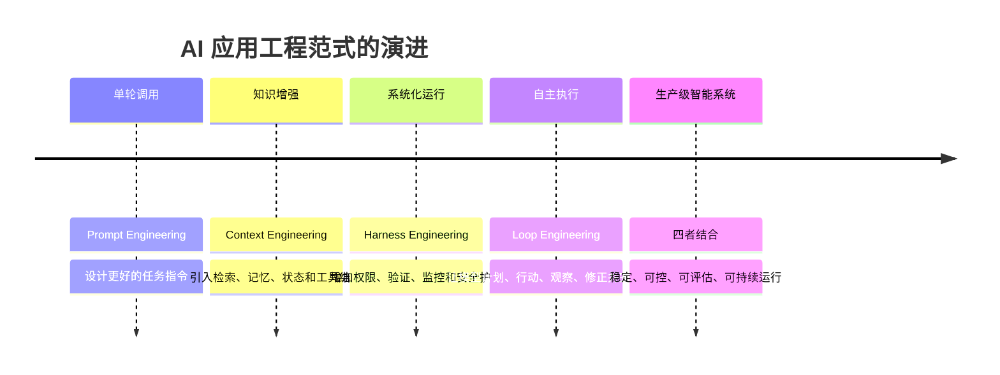

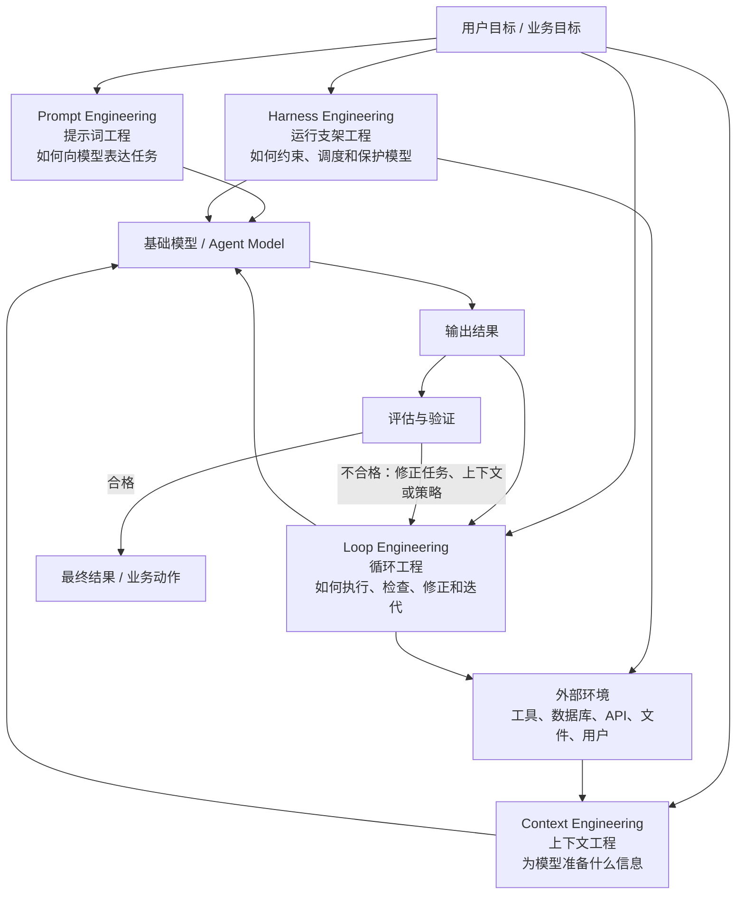

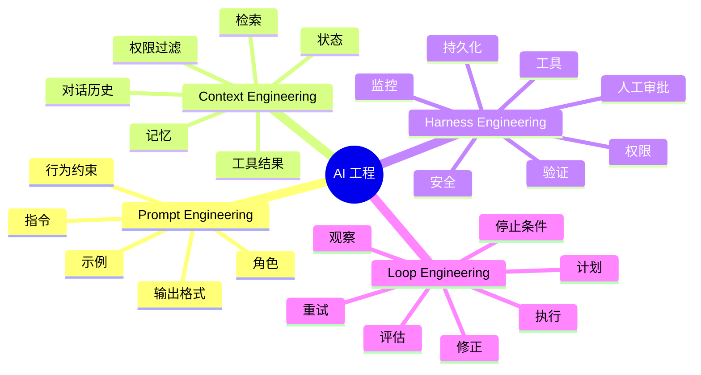
> **Prompt Engineering 解决“怎么告诉模型”，Context Engineering 解决“给模型看什么”，Harness Engineering 解决“如何让模型安全可靠地工作”，Loop Engineering 解决“如何让模型通过多轮反馈把复杂任务真正做完”。**

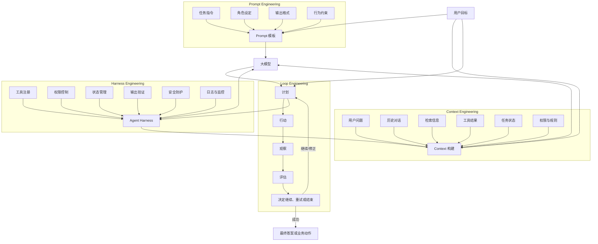

# PE Prompt Engineering

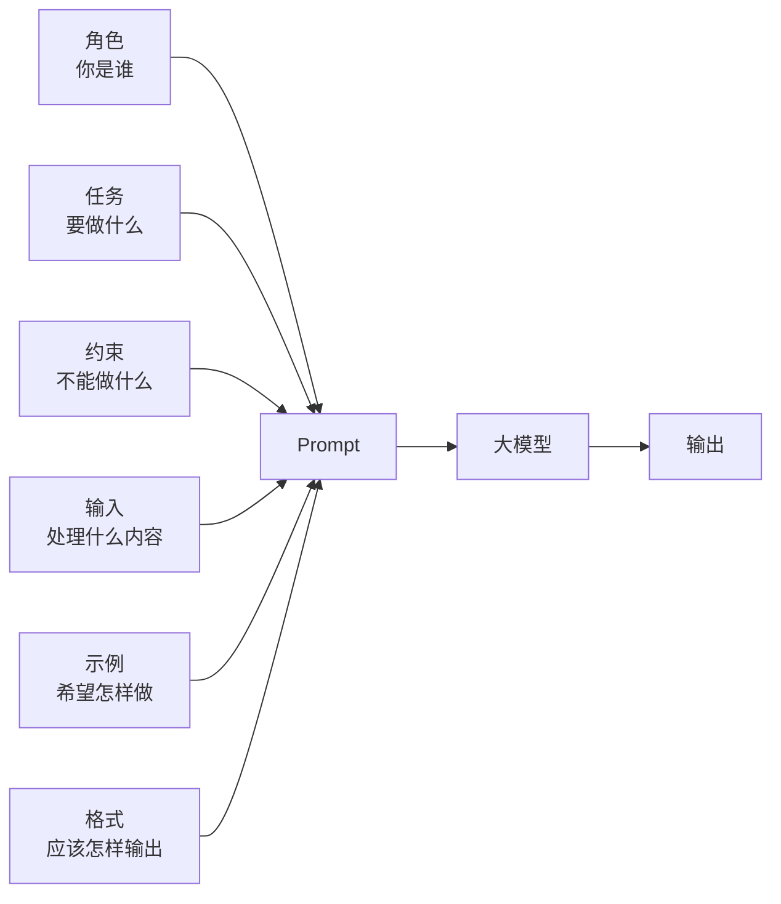

# CE Context Engineering

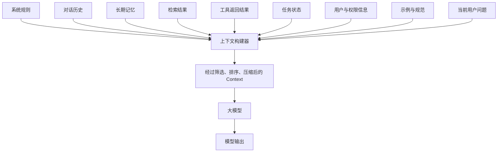
典型流程

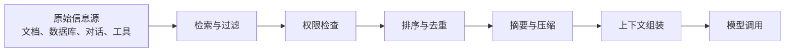

# HE Harness Engineering

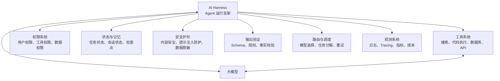

案例：一个自动执行数据库查询的 AI 系统

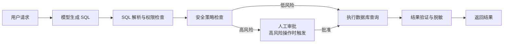

# LE Loop Engineering

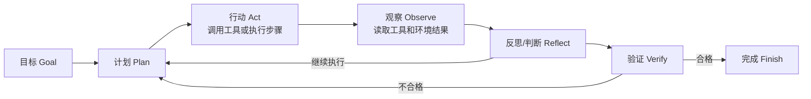

案例：生成一份市场研究报告

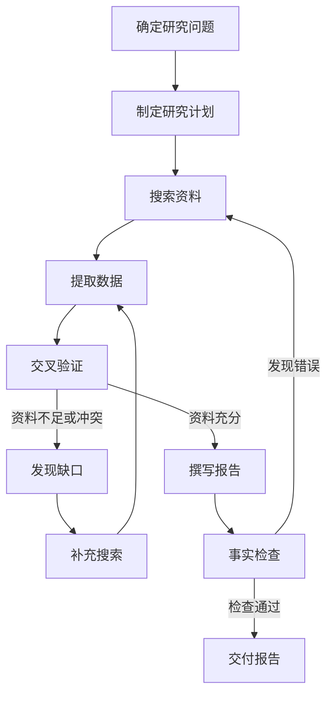

# 四者的质量评价指标

## Prompt Engineering 指标

- 指令遵循率
- 输出格式正确率
- 任务完成率
- 风格一致性
- 幻觉率
- 对异常输入的鲁棒性

## Context Engineering 指标

- 检索召回率
- 上下文相关性
- 上下文压缩率
- 上下文污染率
- 长上下文利用效率
- 权限过滤准确率
- 信息时效性

## Harness Engineering 指标

- 工具调用成功率
- 权限违规率
- 输出验证通过率
- 任务可恢复性
- 平均延迟
- Token 成本
- 安全事件数量
- 日志和追踪完整度

## Loop Engineering 指标

- 任务最终成功率
- 平均循环次数
- 重试率
- 无效循环率
- 单次任务成本
- 任务完成时间
- 失败后恢复成功率
- 人工介入比例
- 自动停止准确率

