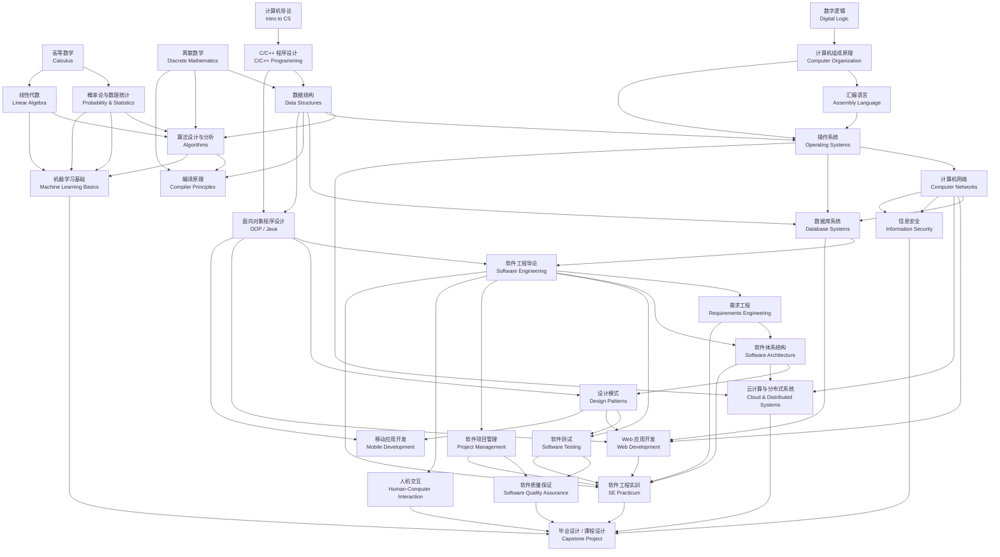

# 本科软件工程课程关系图

涵盖主要课程模块及其先修/支撑关系

**图的结构说明：**

| 层次 | 内容 |
|------|------|
| 数学与基础（A） | 支撑算法、概率、离散推理等所有后续课程的底座 |
| 计算机基础（B） | 从编程入门到硬件原理，建立机器层面认知 |
| 核心专业课（C） | 数据结构、算法、OS、网络、数据库、编译，构成专业骨架 |
| 软件工程核心（D） | OOP → 软件工程方法论 → 架构/模式/测试/质量/管理的完整链条 |
| 应用与进阶（E） | Web、移动、HCI、云、安全、ML，各有独立技术栈但依赖核心课 |
| 综合实践（F） | 实训和毕设汇聚上层所有课程，是输出验证节点 |

几条关键先修链值得注意：
- **离散数学 → 数据结构 → 算法** 是理论主干
- **C/C++ → OOP → 软件工程导论 → 架构/模式/测试** 是工程主干
- **计算机网络 → Web开发 / 云计算 / 信息安全** 是应用主干
